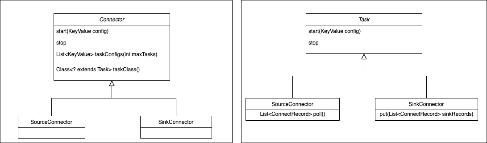
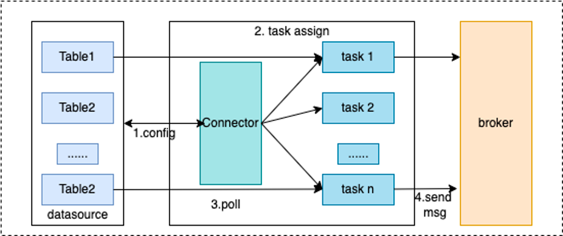
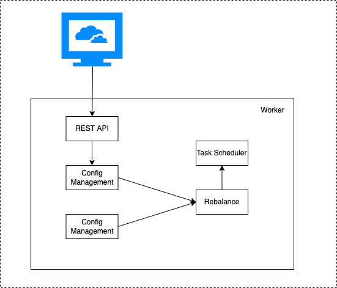

# RocketMQ Connect Concept

## Connector

The connector defines where the data is copied from and where it is copied to. It reads data from the source system and writes it to RocketMQ, which is the SourceConnector, or reads data from RocketMQ and writes it to the target system, which is the SinkConnector. The Connector decides the number of tasks to be created, and receives configuration from the Worker and passes it to the task.

## Task

Task is the minimum allocation unit of Connector task sharding, which is responsible for actually copying the source data to RocketMQ (SourceTask), or reading data from RocketMQ and writing it to the target system (SinkTask). Tasks are stateless, and can be started and stopped dynamically. Multiple tasks can be executed in parallel, and the parallelism of data copying by the Connector is mainly reflected in the number of tasks.

Through Connect's API, you can also see the responsibilities of Connector and Task, Connector has determined the data copy flow when it is implemented, Connector receives data source related configuration, taskClass obtains the type of task to be created, and taskConfigs specifies the maximum number of tasks, and allocates configuration for tasks. After task gets the configuration, it reads data from the data source and writes it to the target storage.

From the following two diagrams, it is clear to see the basic flow of processing for Connector and Task.

## Worker

The worker process is the running environment for Connector and Task, it provides RESTful capabilities, accepts HTTP requests, and passes the obtained configuration to Connector and Task. In addition, it is responsible for starting Connector and Task, saving Connector configuration information, saving the position information of Task's synchronized data, and load balancing capability. High availability, scaling and fault handling of Connect clusters mainly rely on the load balancing capability of Worker.

From the above diagram, it can be seen that the Worker receives http requests through the provided REST API, and passes the received configuration information to the configuration management service. The configuration management service saves the configuration locally and synchronizes it with other worker nodes, while also triggering load balancing.
