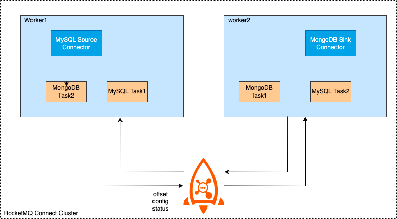

# RocketMQ Connect Overview

RocketMQ Connect is an important component of RocketMQ data integration, which can transfer data in and out of RocketMQ from various systems efficiently and reliably. It is a separate, distributed, scalable, and fault-tolerant system that has low latency, high reliability, high performance, low code, and strong scalability. It can achieve various heterogeneous data system connections, data pipeline building, ETL, CDC, and data lake capabilities.

### Connector working principle

RocketMQ Connect is a standalone, distributed, scalable, and fault-tolerant system that mainly provides RocketMQ with the ability to flow data in and out of various external systems. Users do not need programming, they only need simple configuration to use RocketMQ Connect, such as synchronizing data from MySQL to RocketMQ, only need to configure the account password, connection address, and the need to synchronize the database and table name.

### Connector use cases

**Building a streaming data pipeline**

In business systems, MySQL's excellent transaction support is used to handle data addition, deletion, and modification, ElasticSearch and Solr are used to achieve powerful search capabilities, or the generated business data is synchronized to the data analysis system and data lake (such as Hudi) for further processing, thus making the data generate higher value. Using RocketMQ Connect, it is easy to realize such data pipeline capabilities. Only three tasks need to be configured: the first task is to get data from MySQL, the second and third tasks are to consume data from RocketMQ to ElasticSearch and Hudi. Configuring these three tasks has realized two data pipelines from MySQL to ElasticSearch and MySQL to Hudi, which can not only meet the needs of transactions in business but also the needs of search, and also can construct a data lake.

##### CDC

CDC, as one of the ETL patterns, can capture the database's INSERT, UPDATE, DELETE changes in near real-time, RocketMQ Connect flow data transmission, with high availability and low latency characteristics, through connector easily realize CDC.

### Connector deployment

When creating a Connector, it is generally completed through configuration. Connector generally includes the logical Connector and the Task that performs data replication, which is the physical thread, as shown in the following figure, two Connector connectors and their corresponding running Task tasks.

A Connector can also run multiple tasks at the same time to increase the parallelism of the Connector. For example, the Hudi Sink Connector in the figure below has 2 tasks, each task handles different shard data, thus increasing the parallelism of the Connector and improving processing performance.

RocketMQ Connect Worker supports two running modes, cluster and single-machine. In cluster mode, as the name implies, there are multiple Worker nodes, it is recommended to have at least 2 Worker nodes to form a highly available cluster. Cluster configuration information, offset information, and status information are stored in a specified RocketMQ Topic. A new Worker node will also obtain these configuration, offset, and status information and trigger load balancing to re-allocate tasks in the cluster to achieve a balanced state, and reduce the number of Worker nodes or when a Worker node goes down, it will also trigger load balancing to ensure that all tasks in the cluster can run normally on the surviving nodes of the cluster.

In standalone mode, Connector tasks run on a single machine and Worker itself does not have high availability, task offset information is persisted locally. It is suitable for scenarios where there is no high availability requirement or does not require Worker to ensure high availability, such as deployment in K8s clusters, which are guaranteed by K8s clusters.

