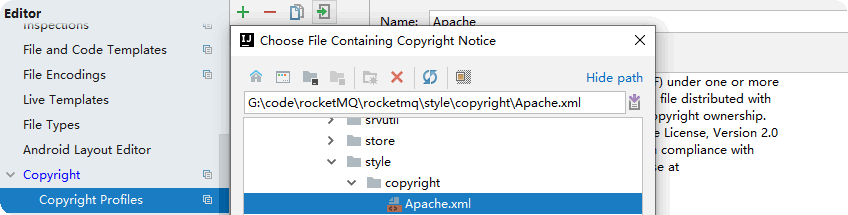

# Code Guidelines

## Introduction

This article introduces you to coding specifications and coding guidelines.

Research shows that 80% of software development time is spent on software maintenance, including source code interpretation, source code refactoring, source code maintenance, etc.

Agreeing on and enforcing code specifications and guidelines can help improve code readability, maintain code ownership by the development team,

help engineers understand new code quickly and deeply, and simplify maintenance costs.

## IDEA Programming Template

The following guides you to import the ```rmq_codeStyle.xml``` encoding specification file and ```Apache.xml``` contribution license file in IDEA.

### Import Code Style

1.File Path: ```rocketmq/style/rmq_codestyle.xml```

2.Apple OS Import: ```IntelliJ IDEA > File > Settings > Editor > Code Style``` enter the ```Code Style```, select the ```Manage > Import``` to import the ```rmq_codestyle.xml``` and name it ```Scheme```

3.Windows OS Import: ```IntelliJ IDEA > File > Settings > Editor > Code Style``` enter the ```Code Style```, select the ```Show Scheme Actions > Import Scheme > Intellij IDEA code style XML``` to import the ```rmq_codestyle.xml```


4.The imported ```rmq_codeStyle.xml``` specifies the code's indentation format, naming conventions, standard Java conventions, and so on

5.After IDEA is set, the code is automatically reformat to pass the code style validate of Travis CI

## Import Apache V2

1.File Path: ```rocketmq/style/copyright/Apache.xml```

2.Import: ```IntelliJ IDEA > File > Settings > Editor > Copyright > Copyright Profiles``` enter the ```Copyright Profiles```, select the ```import``` to import the ```Apache.xml```



3.License: [Apache License, Version 2.0](https://www.apache.org/licenses/LICENSE-2.0)

## Select Apache Copyright


Refer to  [Five open source protocols(GPL,LGPL,BSD,MIT,Apache) - OSCHINA - Chinese open source technology exchange community](https://www.oschina.net/question/54100_9455) For details

## Remove Javadoc Label

1. select the ```Settings > Editor > File and Code Templates > Includes```

2. enter the ```File Header``` , remove the Javadoc label from it

