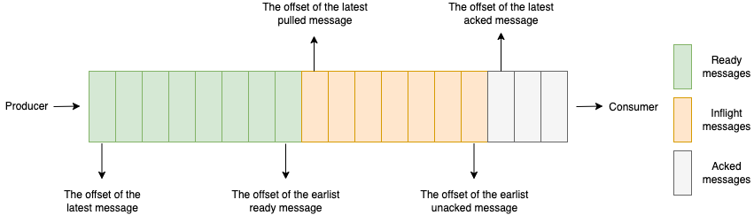
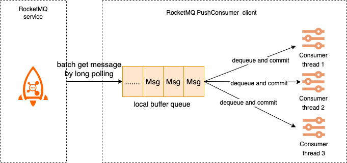

# Metrics

RocketMQ exposes the following metrics in Prometheus format. You can monitor your clusters with those metrics.

- Broker metrics
- Producer metrics
- Consumer metrics

> Version support: The following metrics for RocketMQ were introduced since 5.1.0 and only support the broker.

## Details of metrics

### Metric types

The standard for defining metrics in RocketMQ complies with that for defining the metrics in open source Prometheus. The metric types that RocketMQ offers include counters, gauges, and histograms. For more information, see [METRIC TYPES](https://prometheus.io/docs/concepts/metric_types/).

### Broker metrics

The following table describes the labels of the metrics that are related to the Message Queue for Apache RocketMQ broker.

- cluster: RocketMQ cluster name.
- node_type: the type of service node, whitch includes the following:proxy,broker,nameserver.
- node_id: the ID of the service node.
- topic: the topic of RocketMQ.
- message_type: the type of a message, which includes the following: normal:normal messages; fifo:ordered messages; transaction:Transactional messages; delay:scheduled or delayed messages.
- consumer_group: the ID of the consumer group.

| Type      | Name                                   | Unit        | Description                                                                                                                                                                                                                                                                                     | Label                                                             |
| --------- | -------------------------------------- | ----------- |-------------------------------------------------------------------------------------------------------------------------------------------------------------------------------------------------------------------------------------------------------------------------------------------------| ----------------------------------------------------------------- |
| counter   | rocketmq_messages_in_total             | count       | The number of messages that are produced.                                                                                                                                                                                                                                                       | cluster,node_type,node_id,topic,message_type                      |
| counter   | rocketmq_messages_out_total            | count       | The number of messages that are consumed.                                                                                                                                                                                                                                                       | cluster,node_type,node_id,topic, consumer_group                   |
| counter   | rocketmq_throughput_in_total           | byte        | The write throughput that are produced.                                                                                                                                                                                                                                                         | cluster,node_type,node_id,topic,message_type                      |
| counter   | rocketmq_throughput_out_total          | byte        | The read throughput that are produced.                                                                                                                                                                                                                                                          | cluster,node_type,node_id,topic, consumer_group                   |
| histogram | rocketmq_message_size                  | byte        | The distribution of message sizes. This metric is counted only when messages are sent. The following shows the distribution ranges: le_1_kb: ≤ 1 KB  le_4_kb: ≤ 4 KB le_512_kb: ≤ 512 KB le_1_mb: ≤ 1 MB le_2_mb: ≤ 2 MB le_4_mb: ≤ 4 MB le_overflow: > 4 MB | cluster,node_type,node_id,topic,message_type                      |
| gauge     | rocketmq_consumer_ready_messages       | count       | The number of ready messages.                                                                                                                                                                                                                                                                   | cluster,node_type,node_id,topic, consumer_group                   |
| gauge     | rocketmq_consumer_inflight_messages    | count       | The number of inflight messages.                                                                                                                                                                                                                                                                | cluster,node_type,node_id,topic, consumer_group                   |
| gauge     | rocketmq_consumer_queueing_latency     | millisecond | Ready messages queueing delay time.                                                                                                                                                                                                                                                             | cluster,node_type,node_id,topic, consumer_group                   |
| gauge     | rocketmq_consumer_lag_latency          | millisecond | The delayed time before messages are consumed.                                                                                                                                                                                                                                                  | cluster,node_type,node_id,topic, consumer_group                   |
| counter   | rocketmq_send_to_dlq_messages_total    | count       | The number of messages that are sent to the dead-letter queue.                                                                                                                                                                                                                                  | cluster,node_type,node_id,topic, consumer_group                   |
| histogram | rocketmq_rpc_latency                   | millisecond | The rpc call latency                                                                                                                                                                                                                                                                            | cluster,node_typ,node_id,protocol_type,request_code,response_code |
| gauge     | rocketmq_storage_message_reserve_time  | millisecond | Message retention time.                                                                                                                                                                                                                                                                         | cluster,node_type,node_id                                         |
| gauge     | rocketmq_storage_dispatch_behind_bytes | byte        | Undispatched message size.                                                                                                                                                                                                                                                                      | cluster,node_type,node_id                                         |
| gauge     | rocketmq_storage_flush_behind_bytes    | byte        | Unflushed messsage size.                                                                                                                                                                                                                                                                        | cluster,node_type,node_id                                         |
| gauge     | rocketmq_thread_pool_wartermark        | count       | The number of tasks queued in the thread pool.                                                                                                                                                                                                                                                  | cluster,node_type,node_id,name                                    |
| histogram | rocketmq_create_topic_time             | millisecond | The topic creation time:  le_10_ms le_100_ms le_1_s le_3_s le_5_s le_overflow                                                                                                                                                                                     | node_id,request_is_success,is_system                            |
| histogram | rocketmq_create_subscription_time      | millisecond | The subscription group creation time:  le_10_ms le_100_ms le_1_s le_3_s le_5_s le_overflow                                                                                                                                                                        | node_id,request_is_success                                      |

### Producer metrics

The following table describes the labels of the metrics that are related to the producers in Message Queue for Apache RocketMQ.

- cluster: RocketMQ cluster name.
- node_type: the type of service node, whitch includes the following:proxy,broker,nameserver.
- node_id: the ID of the service node.
- topic: the topic of Message Queue for Apache RocketMQ.
- message_type: the type of a message, which includes the following: normal:normal messages; fifo:ordered messages; transaction:Transactional messages; delay:scheduled or delayed messages.
- client_id: the ID of the client.
- invocation_status: the result of the API call for sending messages, which includes success and failure.

| Type      | Name                    | Unit        | Description                                                                                                                                                                                                        | Label                             |
| --------- | ----------------------- | ----------- | ------------------------------------------------------------------------------------------------------------------------------------------------------------------------------------------------------------------ | --------------------------------- |
| Histogram | rocketmq_send_cost_time | millisecond | The distribution of production API call time. The following shows the distribution ranges:  le_1_ms  le_5_ms le_10_ms le_20_ms  le_50_ms  le_200_ms le_500_ms  le_overflow | topic,client_id,invocation_status |

### Consumer metrics

The following table describes the labels of the metrics that are related to the consumers in Message Queue for Apache RocketMQ.

- topic: the topic of Message Queue for Apache RocketMQ.
- consumer_group: the ID of the consumer group.
- client_id: the ID of the client.
- invocation_status: the result of the API call for sending messages, which includes success and failure.

| Type      | Name                              | Unit        | Description                                                                                                                                                                                                                                                        | Label                                            |
| --------- | --------------------------------- | ----------- | ------------------------------------------------------------------------------------------------------------------------------------------------------------------------------------------------------------------------------------------------------------------ | ------------------------------------------------ |
| Histogram | rocketmq_process_time             | millisecond | The distribution of message process time.The following shows the distribution ranges:  le_1_ms  le_5_ms   le_10_ms le_100_ms  le_10000_ms le_60000_ms  le_overflow                                                              | topic,consumer_group,client_id,invocation_status |
| gauge     | rocketmq_consumer_cached_messages | message     | The number of messages in the local buffer queue of PushConsumer.                                                                                                                                                                                                  | topic,consumer_group,client_id                   |
| gauge     | rocketmq_consumer_cached_bytes    | byte        | The total size of messages in the local buffer queue of PushConsumer.                                                                                                                                                                                              | topic,consumer_group,client_id                   |
| Histogram | rocketmq_await_time               | millisecond | The distribution of queuing time for messages in the local buffer queue of PushConsumer. The following shows the distribution ranges: le_1_ms  le_5_ms le_20_ms le_100_ms  le_1000_ms  le_5000_ms  le_10000_ms le_overflow | topic,consumer_group,client_id                   |

## Background information

RocketMQ defines metrics based on the following business scenarios.

### Message accumulation scenarios

 The above figure shows the number and duration of messages in different stages. By monitoring these metrics, you can determine whether the business consumption is abnormal. The following table describes the meaning of these metrics and the formulas that are used to calculate these metrics.

| Name                     | Description                                                                                                                                                                               | Formula                                                                      |
| ------------------------ | ----------------------------------------------------------------------------------------------------------------------------------------------------------------------------------------- | ---------------------------------------------------------------------------- |
| Inflight messages        | The number of messages being processed by consumer but not acked yet                                                                                                                      | Offset of the latest pulled message - Offset of the latest committed message |
| Ready messages           | The number of messages that are ready for consumption.                                                                                                                                    | Maximum offset - Offset of the latest pulled message                         |
| Ready time               | normal message or ordered message:the time when the message is stored to the broker.    Scheduled message:timing end time.    Transactional message: transaction commit time.   | --                                                                           |
| Ready message queue time | The time interval between the ready time of the earliest ready message and the current time. This time reflects the timeliness of consumers pulling messages.                             | Current time - Ready time of the earliest ready message                      |
| Consumer lag time        | The time difference between the ready time of the earliest unacked message and the current moment. This time reflects the timeliness of the consumer to complete message processing. | Current time - Ready time of the earliest unacked message                    |

### PushConsumer consumption scenarios

In PushConsumer, real-time message processing capability is implemented based on the typical Reactor thread model inside the SDK.As shown below, the SDK has a built-in long polling thread that asynchronously pulls messages into the SDK's built-in buffer queue and then separately commits them to the consumer thread, triggering the listener to execute the local consumption logic.  The metrics of local buffer queues in the PushConsumer scenario are as follows:

- Number of messages in the local buffer queue: Total number of messages in the local buffer queue.
- Message size in the local buffer queue: The sum of all message sizes in the local buffer queue.
- Message waiting time: the time that the message is temporarily cached in the local buffer queue waiting to be processed.

## How to Obtain Metrics

Currently, two exporters are supported: gRPC OTLP and Prometheus.

### gRPC OTLP Exporter

The gRPC OTLP exporter periodically reports metrics to the specified OpenTelemetry Collector.

Prerequisites: Deploy an OpenTelemetry Collector that supports the [GRPC OpenTelemetry Protocol](https://github.com/open-telemetry/oteps/blob/main/text/0035-opentelemetry-protocol.md).

To enable the gRPC OTLP exporter of Broker metrics, do the following:

1. Set `metricsExporterType` to `OTLP_GRPC`.
2. Set `metricsGrpcExporterTarget` to the endpoint provided by the OpenTelemetry Collector.

Optional configurations:

1. `metricsGrpcExporterHeader`: Attach request headers to the gRPC OTLP exporter in the format of key1:value1,key2:value2.
2. `metricGrpcExporterTimeOutInMills`: Set the request timeout for the gRPC OTLP exporter.
3. `metricGrpcExporterIntervalInMills`: Set the reporting interval for the gRPC OTLP exporter.

### Prometheus Exporter

The Prometheus exporter only supports Pull mode and Cumulative aggregation. See [OpenTelemetry Metrics Exporter - Prometheus](https://opentelemetry.io/docs/reference/specification/metrics/sdk_exporters/prometheus/) for more information.

To enable the Prometheus exporter of Broker metrics, do the following:

1. Set `metricsExporterType` to `PROM`.

Visit `http://<broker-ip>:5557/metrics` to view metrics. Configure service discovery or manually configure a pull task in Prometheus to collect metrics.

Optional configurations:

1. `metricsPromExporterPort`: The port number on which Broker exposes the metrics service. The default is `5557`.
2. `metricGrpcExporterTimeOutInMills`: The hostname for the exposed metrics service. The default is the IP to which Broker registers with NameServer, brokerIP1.
