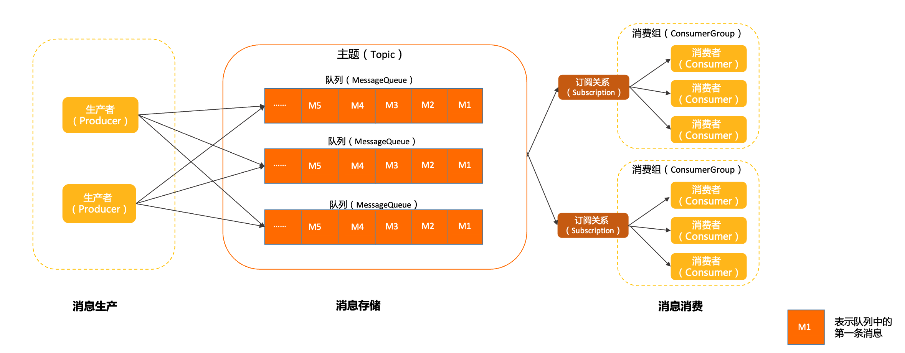
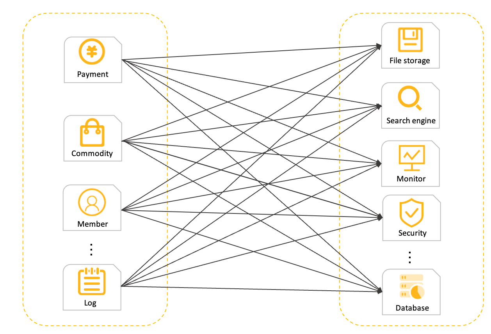
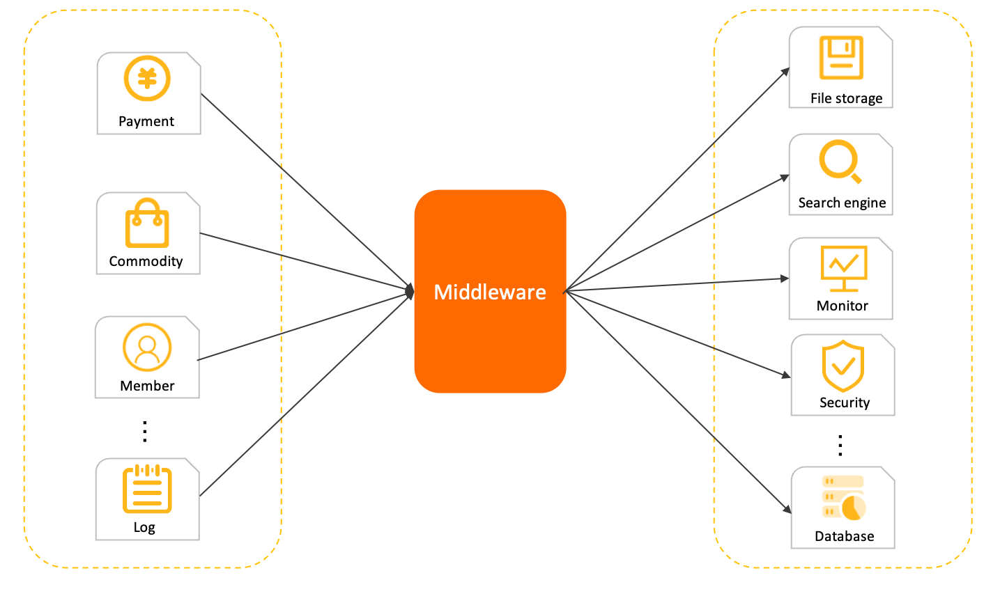
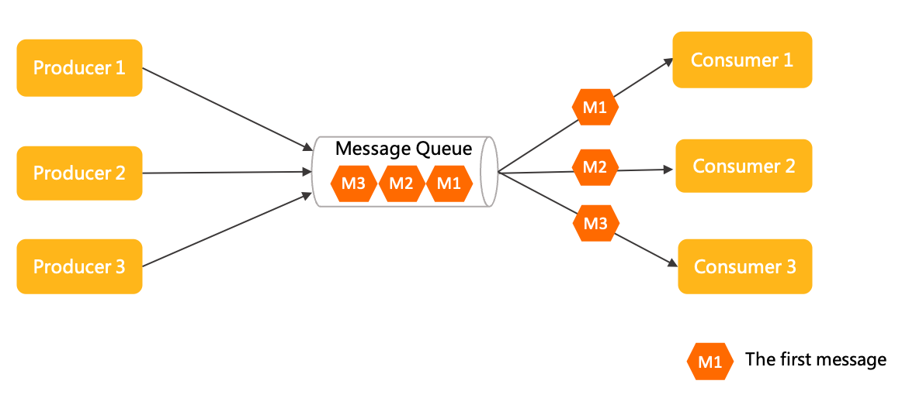
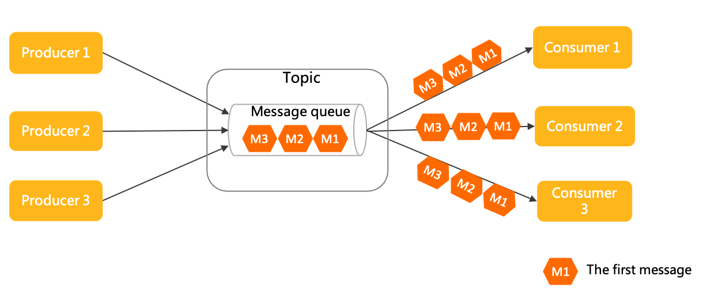

# 领域模型概述

本文为您介绍 Apache RocketMQ 的领域模型。

Apache RocketMQ 是一款典型的分布式架构下的中间件产品，使用异步通信方式和发布订阅的消息传输模型。通信方式和传输模型的具体说明，请参见下文**通信方式介绍**和**消息传输模型**介绍。
Apache RocketMQ 产品具备异步通信的优势，系统拓扑简单、上下游耦合较弱，主要应用于异步解耦，流量削峰填谷等场景。

## Apache RocketMQ领域模型

如上图所示，Apache RocketMQ 中消息的生命周期主要分为消息生产、消息存储、消息消费这三部分。

生产者生产消息并发送至 Apache RocketMQ 服务端，消息被存储在服务端的主题中，消费者通过订阅主题消费消息。

**消息生产**

[生产者（Producer）](../03-domainModel/04producer.md)：

Apache RocketMQ 中用于产生消息的运行实体，一般集成于业务调用链路的上游。生产者是轻量级匿名无身份的。

**消息存储**

* [主题（Topic）](../03-domainModel/02topic.md)：

  Apache RocketMQ 消息传输和存储的分组容器，主题内部由多个队列组成，消息的存储和水平扩展实际是通过主题内的队列实现的。

* [队列（MessageQueue）](../03-domainModel/03messagequeue.md)：

  Apache RocketMQ 消息传输和存储的实际单元容器，类比于其他消息队列中的分区。 Apache RocketMQ 通过流式特性的无限队列结构来存储消息，消息在队列内具备顺序性存储特征。

* [消息（Message）](../03-domainModel/04message.md)：

  Apache RocketMQ 的最小传输单元。消息具备不可变性，在初始化发送和完成存储后即不可变。

**消息消费**

* [消费者分组（ConsumerGroup）](../03-domainModel/07consumergroup.md)：

  Apache RocketMQ 发布订阅模型中定义的独立的消费身份分组，用于统一管理底层运行的多个消费者（Consumer）。同一个消费组的多个消费者必须保持消费逻辑和配置一致，共同分担该消费组订阅的消息，实现消费能力的水平扩展。

* [消费者（Consumer）](../03-domainModel/08consumer.md)：

  Apache RocketMQ 消费消息的运行实体，一般集成在业务调用链路的下游。消费者必须被指定到某一个消费组中。

* [订阅关系（Subscription）](../03-domainModel/09subscription.md)：

  Apache RocketMQ 发布订阅模型中消息过滤、重试、消费进度的规则配置。订阅关系以消费组粒度进行管理，消费组通过定义订阅关系控制指定消费组下的消费者如何实现消息过滤、消费重试及消费进度恢复等。

  Apache RocketMQ 的订阅关系除过滤表达式之外都是持久化的，即服务端重启或请求断开，订阅关系依然保留。

  

## 通信方式介绍

分布式系统架构思想下，将复杂系统拆分为多个独立的子模块，例如微服务模块。此时就需要考虑子模块间的远程通信，典型的通信模式分为以下两种，一种是同步的RPC远程调用；一种是基于中间件代理的异步通信方式。

同步RPC调用模型

同步RPC调用模型下，不同系统之间直接进行调用通信，每个请求直接从调用方发送到被调用方，然后要求被调用方立即返回响应结果给调用方，以确定本次调用结果是否成功。
**注意** 此处的同步并不代表RPC的编程接口方式，RPC也可以有异步非阻塞调用的编程方式，但本质上仍然是需要在指定时间内得到目标端的直接响应。

异步通信模型

异步消息通信模式下，各子系统之间无需强耦合直接连接，调用方只需要将请求转化成异步事件（消息）发送给中间代理，发送成功即可认为该异步链路调用完成，剩下的工作中间代理会负责将事件可靠通知到下游的调用系统，确保任务执行完成。该中间代理一般就是消息中间件。

异步通信的优势如下：

* 系统拓扑简单由于调用方和被调用方统一和中间代理通信，系统是星型结构，易于维护和管理。

  

* 上下游耦合性弱上下游系统之间弱耦合，结构更灵活，由中间代理负责缓冲和异步恢复。 上下游系统间可以独立升级和变更，不会互相影响。

  

* 容量削峰填谷基于消息的中间代理往往具备很强的流量缓冲和整形能力，业务流量高峰到来时不会击垮下游。

## 消息传输模型介绍

主流的消息中间件的传输模型主要为点对点模型和发布订阅模型。

点对点模型

点对点模型也叫队列模型，具有如下特点：

* 消费匿名：消息上下游沟通的唯一的身份就是队列，下游消费者从队列获取消息无法申明独立身份。

* 一对一通信：基于消费匿名特点，下游消费者即使有多个，但都没有自己独立的身份，因此共享队列中的消息，每一条消息都只会被唯一一个消费者处理。因此点对点模型只能实现一对一通信。

发布订阅模型

发布订阅模型具有如下特点：

* 消费独立：相比队列模型的匿名消费方式，发布订阅模型中消费方都会具备的身份，一般叫做订阅组（订阅关系），不同订阅组之间相互独立不会相互影响。

* 一对多通信：基于独立身份的设计，同一个主题内的消息可以被多个订阅组处理，每个订阅组都可以拿到全量消息。因此发布订阅模型可以实现一对多通信。

传输模型对比

点对点模型和发布订阅模型各有优势，点对点模型更为简单，而发布订阅模型的扩展性更高。 Apache RocketMQ 使用的传输模型为发布订阅模型，因此也具有发布订阅模型的特点。

