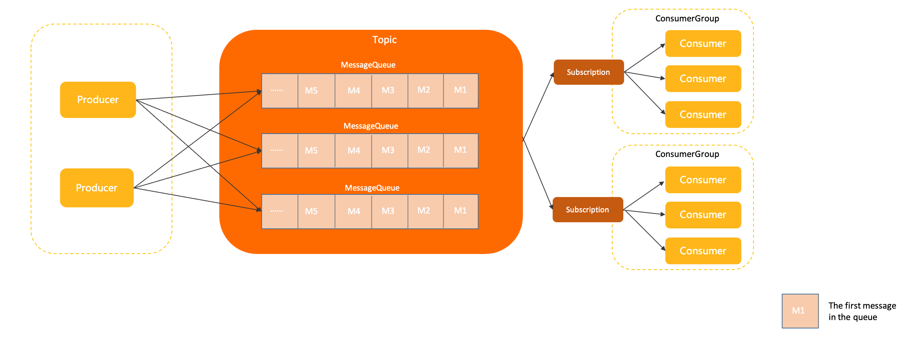

# 主题（Topic）

本文介绍 Apache RocketMQ 中主题（Topic）的定义、模型关系、内部属性、行为约束、版本兼容性及使用建议。

## 定义 

主题是 Apache RocketMQ 中消息传输和存储的顶层容器，用于标识同一类业务逻辑的消息。 主题的作用主要如下：

* **定义数据的分类隔离：** 在 Apache RocketMQ 的方案设计中，建议将不同业务类型的数据拆分到不同的主题中管理，通过主题实现存储的隔离性和订阅隔离性。

* **定义数据的身份和权限：** Apache RocketMQ 的消息本身是匿名无身份的，同一分类的消息使用相同的主题来做身份识别和权限管理。


## 模型关系 


在整个 Apache RocketMQ 的领域模型中，主题所处的流程和位置如下：



主题是 Apache RocketMQ 的顶层存储，所有消息资源的定义都在主题内部完成，但主题是一个逻辑概念，并不是实际的消息容器。

主题内部由多个队列组成，消息的存储和水平扩展能力最终是由队列实现的；并且针对主题的所有约束和属性设置，最终也是通过主题内部的队列来实现。

## 内部属性 

**主题名称**

* 定义：主题的名称，用于标识主题，主题名称集群内全局唯一。

* 取值：由用户创建主题时定义。

* 约束：请参见[参数限制](../01-introduction/03limits.md)。


**队列列表**

* 定义：队列作为主题的组成单元，是消息存储的实际容器，一个主题内包含一个或多个队列，消息实际存储在主题的各队列内。更多信息，请参见[队列（MessageQueue）](../03-domainModel/03messagequeue.md)。

* 取值：系统根据队列数量给主题分配队列，队列数量创建主题时定义。

* 约束：一个主题内至少包含一个队列。


**消息类型**

* 定义：主题所支持的消息类型。

* 取值：创建主题时选择消息类型。Apache RocketMQ 支持的主题类型如下：
  * Normal：[普通消息](../04-featureBehavior/01normalmessage.md)，消息本身无特殊语义，消息之间也没有任何关联。
  
  * FIFO：[顺序消息](../04-featureBehavior/03fifomessage.md)，Apache RocketMQ 通过消息分组MessageGroup标记一组特定消息的先后顺序，可以保证消息的投递顺序严格按照消息发送时的顺序。
  
  * Delay：[定时/延时消息](../04-featureBehavior/02delaymessage.md)，通过指定延时时间控制消息生产后不要立即投递，而是在延时间隔后才对消费者可见。
  
  * Transaction：[事务消息](../04-featureBehavior/04transactionmessage.md)，Apache RocketMQ 支持分布式事务消息，支持应用数据库更新和消息调用的事务一致性保障。
  
* 约束：Apache RocketMQ 从5.0版本开始，支持强制校验消息类型，即每个主题只允许发送一种消息类型的消息，这样可以更好的运维和管理生产系统，避免混乱。为保证向下兼容4.x版本行为，强制校验功能默认开启。


## 行为约束

**消息类型强制校验**

Apache RocketMQ 5.x版本支持将消息类型拆分到主题中进行独立运维和处理，因此系统会对发送的消息类型和主题定的消息类型进行强制校验，若校验不通过，则消息发送请求会被拒绝，并返回类型不匹配异常。校验原则如下：

* 消息类型必须一致：发送的消息的类型，必须和目标主题定义的消息类型一致。

* 主题类型必须单一：每个主题只支持一种消息类型，不允许将多种类型的消息发送到同一个主题中。

:::info

为保证向下兼容4.x版本行为，上述强制校验功能默认开启。

:::

**常见错误使用场景**

* 发送的消息类型不匹配。例如：创建主题时消息类型定义为顺序消息，发送消息时发送事务消息到该主题中，此时消息发送请求会被拒绝，并返回类型不匹配异常。

* 单一消息主题混用。例如：创建主题时消息类型定义为普通消息，发送消息时同时发送普通消息和顺序消息到该主题中，则顺序消息的发送请求会被拒绝，并返回类型不匹配异常。


## 版本兼容性 


消息类型的强制校验，仅 Apache RocketMQ 服务端5.x版本支持，且默认开启，推荐部署时打开配置。 Apache RocketMQ 服务端4.x和3.x历史版本的SDK不支持强制校验，您需要自己保证消息类型一致。 如果您使用的服务端版本为历史版本，建议您升级到
Apache RocketMQ 服务端5.x版本。

## 使用示例
Apache RocketMQ 5.0版本下创建主题操作，推荐使用mqadmin工具，需要注意的是，对于消息类型需要通过属性参数添加。示例如下：

```shell
sh mqadmin updateTopic -n <nameserver_address> -t <topic_name> -c <cluster_name> -a +message.type=<message_type>
```
其中message_type根据消息类型设置成Normal/FIFO/Delay/Transaction。如果不设置，默认为Normal类型。

## 使用建议 

**按照业务分类合理拆分主题**


Apache RocketMQ 的主题拆分设计应遵循大类统一原则，即将相同业务域内同一功能属性的消息划分为同一主题。拆分主题时，您可以从以下角度考虑拆分粒度：

* 消息类型是否一致：不同类型的消息，如顺序消息和普通消息需要使用不同的主题。

* 消息业务是否关联：如果业务没有直接关联，比如，淘宝交易消息和盒马物流消息没有业务交集，需要使用不同的消息主题；同样是淘宝交易消息，女装类订单和男装类订单可以使用同一个订单。当然，如果业务量较大或其他子模块应用处理业务时需要进一步拆分订单类型，您也可以将男装订单和女装订单的消息拆分到两个主题中。

* 消息量级是否一样：数量级不同或时效性不同的业务消息建议使用不同的主题，例如某些业务消息量很小但是时效性要求很强，如果跟某些万亿级消息量的业务使用同一个主题，会增加消息的等待时长。


**正确拆分示例：** 线上商品购买场景下，订单交易如订单创建、支付、取消等流程消息使用一个主题，物流相关消息使用一个主题，积分管理相关消息使用一个主题。

**错误拆分示例：**

* 拆分粒度过粗：会导致业务隔离性差，不利于独立运维和故障处理。例如，所有交易消息和物流消息都共用一个主题。

* 拆分粒度过细：会消耗大量主题资源，造成系统负载过重。例如，按照用户ID区分，每个用户ID使用一个主题。


**单一主题只收发一种类型消息，避免混用**


Apache RocketMQ 主题的设计原则为通过主题隔离业务，不同业务逻辑的消息建议使用不同的主题。同一业务逻辑消息的类型都相同，因此，对于指定主题，应该只收发同一种类型的消息。

**主题管理尽量避免自动化机制**

在 Apache RocketMQ 架构中，主题属于顶层资源和容器，拥有独立的权限管理、可观测性指标采集和监控等能力，创建和管理主题会占用一定的系统资源。因此，生产环境需要严格管理主题资源，请勿随意进行增、删、改、查操作。


Apache RocketMQ 虽然提供了自动创建主题的功能，但是建议仅在测试环境使用，生产环境请勿打开，避免产生大量垃圾主题，无法管理和回收并浪费系统资源。

