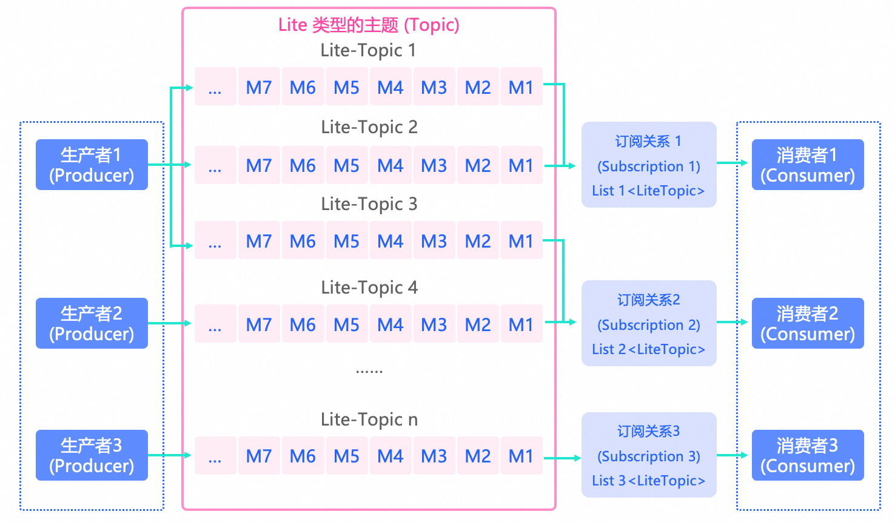

# 轻量主题（LiteTopic）

本文介绍Apache RocketMQ中轻量主题（LiteTopic）的定义、模型关系、内部属性、行为约束、版本兼容性及使用建议。

## 定义

轻量主题是Apache RocketMQ中消息传输和存储的二级容器，用于标识同一类业务逻辑下不同子类（例如不同会话、任务等粒度）的消息。

轻量主题的作用主要如下：

* 实现排他性消费，定义数据的二级隔离

  建议将不同子类的数据拆分到不同的轻量主题中管理，通过轻量主题实现更细致的存储隔离性和订阅隔离性。

* 定义数据的身份和权限

  在基于主题的身份识别和权限管理基础上，可以通过轻量主题，进一步细分用户的身份与权限。

## 模型关系

在整个Apache RocketMQ的领域模型中，轻量主题所处的流程和位置如下：

* 主题（Topic）是Apache RocketMQ中消息传输和存储的顶层容器。当类型为Lite类型时，Topic下可创建轻量主题（LiteTopic），由Topic和LiteTopic共同唯一确认消息的存储容器。

* 当类型为Lite类型时，每个存储容器默认由一个队列组成。

## 内部属性

### 轻量主题名称

* 定义：轻量主题的名称，用于标识轻量主题，轻量主题名称在所属主题内全局唯一。

* 取值：当主题类型为Lite时，用户对message进行了setLiteTopic，如对应的轻量主题不存在，系统会自动创建。

* 约束：请参见[参数限制](../01-introduction/03limits.md)。

### 过期时间

* 定义：轻量主题的过期时间，当轻量主题距离最近一次消息写入时间超过过期时间后，该轻量主题会被自动删除。删除是指释放轻量主题占用的个数，即占用总数-1。

* 取值：当创建主题类型为Lite时，可以设置过期时间 expiration 值。

* 约束：请参见[参数限制](../01-introduction/03limits.md)。

## 版本兼容性

* 服务端版本：5.5.0 版本及以上

* 客户端版本：RocketMQ gRPC 5.1.0 版本及以上

## 轻量类型和普通类型主题的差异

| **场景** | **对比项** | **轻量类型主题** | **普通类型主题** |
|--------|--------|------------|------------|
| 消息存储 | 一级主题 | 相同。都需要预先创建主题资源。 | 相同。都需要预先创建主题资源。 |
| 消息存储 | 二级主题 | 可以在Topic下创建百万量级的二级主题资源LiteTopic，该二级资源有许多新特性。 | 无二级主题资源。 |
| 消息存储 | 自动化生命周期管理 | 二级主题LiteTopic的生命周期可以自动化管理：自动创建（发送或订阅时如不存在则自动创建）；自动删除（设置expiration时间，持续无新消息发送后会自动删除）。 | 无 |
| 消息存储 | 顺序性 | 每个LiteTopic只创建一个队列，同一个队列中的消息存储是顺序的。 | 会创建多个队列，只有分区顺序Topic |
| 消息存储 | 收发并发TPS上限 | 由于只有一个队列，每个LiteTopic的TPS上限是有限的。但Topic下可以创建百万量级的LiteTopic，总TPS的上限是可以根据LiteTopic的增加而增加。 | Topic的TPS可以根据队列数量和集群机器节点数量横向扩容。 |
| 消息消费 | 订阅关系一致性 | 可以不一致。同一Group下，每个消费者可订阅不同的LiteTopic集合，Group的限制弱化。 | 需要一致。同一Group下，每个消费者的订阅关系需要保持一致，共享目标主题下的消息。 |
| 消息消费 | 顺序性 | 顺序消费，一个LiteTopic下的消息只能被一个消费者线程处理。 | 可选择并发消费或顺序消费。 |
| 消息消费 | 动态订阅 | 每个消费者可以动态增加或删除指定某个LiteTopic的订阅 | 无 |
| 消息消费 | 单个消费者可以订阅的LiteTopic的数量 | 每个消费者可以订阅千量级的LiteTopic | 无 |
| 可观测 | Metrics指标数据 | 有消息堆积量指标，无消息处理滞后时间指标 | 有消息堆积量指标，有消息处理滞后时间指标 |
| 可观测 | 消息轨迹 | 相同 | 相同 |

