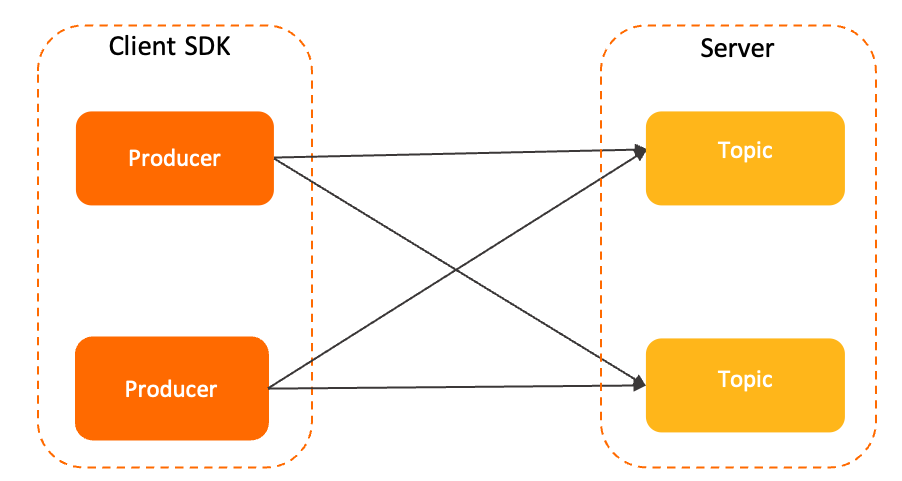
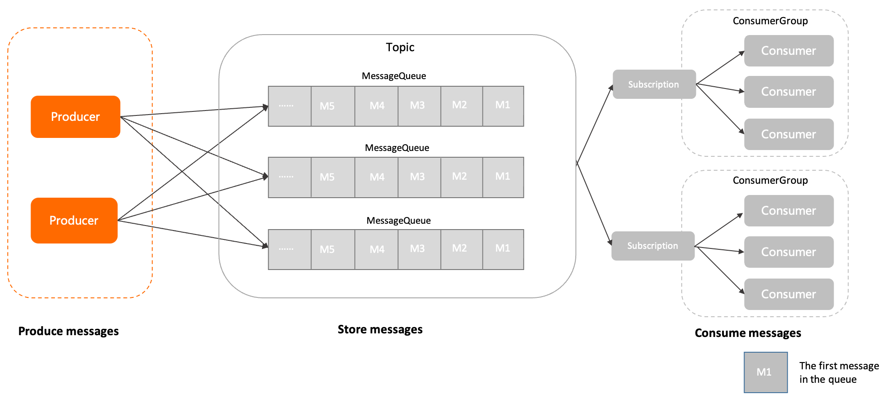

# 生产者（Producer）

本文介绍 Apache RocketMQ 中生产者（Producer）的定义、模型关系、内部属性、版本兼容性及使用建议。

## 定义

生产者是 Apache RocketMQ 系统中用来构建并传输消息到服务端的运行实体。

生产者通常被集成在业务系统中，将业务消息按照要求封装成 Apache RocketMQ 的[消息（Message）](./04message.md)并发送至服务端。

在消息生产者中，可以定义如下传输行为：

* 发送方式：生产者可通过API接口设置消息发送的方式。Apache RocketMQ 支持同步传输和异步传输。

* 批量发送：生产者可通过API接口设置消息批量传输的方式。例如，批量发送的消息条数或消息大小。

* 事务行为：Apache RocketMQ 支持事务消息，对于事务消息需要生产者配合进行事务检查等行为保障事务的最终一致性。具体信息，请参见[事务消息](../04-featureBehavior/04transactionmessage.md)。


生产者和主题的关系为多对多关系，即同一个生产者可以向多个主题发送消息，对于平台类场景如果需要发送消息到多个主题，并不需要创建多个生产者；同一个主题也可以接收多个生产者的消息，以此可以实现生产者性能的水平扩展和容灾。


## 模型关系

在 Apache RocketMQ 的领域模型中，生产者的位置和流程如下：

1. 消息由生产者初始化并发送到Apache RocketMQ 服务端。

2. 消息按照到达Apache RocketMQ 服务端的顺序存储到主题的指定队列中。

3. 消费者按照指定的订阅关系从Apache RocketMQ 服务端中获取消息并消费。


## 内部属性 


**客户端ID**

* 定义：生产者客户端的标识，用于区分不同的生产者。集群内全局唯一。

* 取值：客户端ID由Apache RocketMQ 的SDK自动生成，主要用于日志查看、问题定位等运维场景，不支持修改。


**通信参数**

* 接入点信息 **（必选）** ：连接服务端的接入地址，用于识别服务端集群。 接入点必须按格式配置，建议使用域名，避免使用IP地址，防止节点变更无法进行热点迁移。
  
* 身份认证信息 **（可选）** ：客户端用于身份验证的凭证信息。 仅在服务端开启身份识别和认证时需要传输。
  
* 请求超时时间 **（可选）** ：客户端网络请求调用的超时时间。取值范围和默认值，请参见[参数限制](../01-introduction/03limits.md)。


**预绑定主题列表**

* 定义：Apache RocketMQ 的生产者需要将消息发送到的目标主题列表，主要作用如下：
  * 事务消息 **（必须设置）** ：事务消息场景下，生产者在故障、重启恢复时，需要检查事务消息的主题中是否有未提交的事务消息。避免生产者发送新消息后，主题中的旧事务消息一直处于未提交状态，造成业务延迟。
  
  * 非事务消息 **（建议设置）** ：服务端会在生产者初始化时根据预绑定主题列表，检查目标主题的访问权限和合法性，而不需要等到应用启动后再检查。

    若未设置，或后续消息发送的目标主题动态变更， Apache RocketMQ 会对目标主题进行动态补充检验。

* 约束：对于事务消息，预绑定列表必须设置，且需要和事务检查器一起配合使用。


**事务检查器**

* 定义：Apache RocketMQ 的事务消息机制中，为保证异常场景下事务的最终一致性，生产者需要主动实现事务检查器的接口。具体信息，请参见[事务消息](../04-featureBehavior/04transactionmessage.md)。

* 发送事务消息时，事务检查器必须设置，且需要和预绑定主题列表一起配合使用。


**发送重试策略**：

* 定义: 生产者在消息发送失败时的重试策略。具体信息，请参见[消息发送重试机制](../04-featureBehavior/05sendretrypolicy.md)。

## 版本兼容性 

Apache RocketMQ 服务端5.x版本开始，生产者是匿名的，无需管理生产者分组（ProducerGroup）；对于历史版本服务端3.x和4.x版本，已经使用的生产者分组可以废弃无需再设置，且不会对当前业务产生影响。

## 使用建议

**不建议单一进程创建大量生产者**


Apache RocketMQ 的生产者和主题是多对多的关系，支持同一个生产者向多个主题发送消息。对于生产者的创建和初始化，建议遵循够用即可、最大化复用原则，如果有需要发送消息到多个主题的场景，无需为每个主题都创建一个生产者。

**不建议频繁创建和销毁生产者**


Apache RocketMQ 的生产者是可以重复利用的底层资源，类似数据库的连接池。因此不需要在每次发送消息时动态创建生产者，且在发送结束后销毁生产者。这样频繁的创建销毁会在服务端产生大量短连接请求，严重影响系统性能。

* 正确示例

  ```java
  Producer p = ProducerBuilder.build();
  for (int i =0;i<n;i++){
      Message m= MessageBuilder.build();
      p.send(m);
   }
  p.shutdown();
  ```
  
  
  
* 典型错误示例

  ```java
  for (int i =0;i<n;i++){
      Producer p = ProducerBuilder.build();
      Message m= MessageBuilder.build();
      p.send(m);
      p.shutdown();
    }
  ```
  


