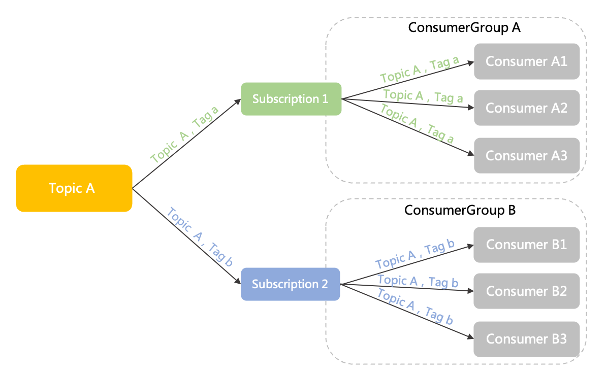
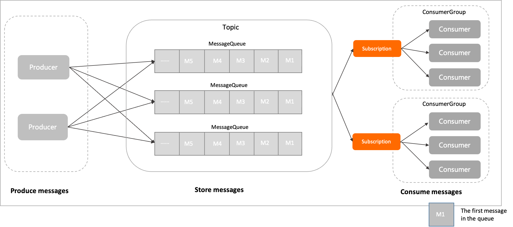

# 订阅关系（Subscription）

本文介绍 Apache RocketMQ 中订阅关系（Subscription）的定义、模型关系、内部属性及使用建议。

## 定义 


订阅关系是 Apache RocketMQ 系统中消费者获取消息、处理消息的规则和状态配置。

订阅关系由消费者分组动态注册到服务端系统，并在后续的消息传输中按照订阅关系定义的过滤规则进行消息匹配和消费进度维护。

通过配置订阅关系，可控制如下传输行为：

* 消息过滤规则：用于控制消费者在消费消息时，选择主题内的哪些消息进行消费，设置消费过滤规则可以高效地过滤消费者需要的消息集合，灵活根据不同的业务场景设置不同的消息接收范围。具体信息，请参见[消息过滤](../04-featureBehavior/07messagefilter.md)。

* 消费状态：Apache RocketMQ 服务端默认提供订阅关系持久化的能力，即消费者分组在服务端注册订阅关系后，当消费者离线并再次上线后，可以获取离线前的消费进度并继续消费。

## 订阅关系判断原则 

Apache RocketMQ 的订阅关系按照消费者分组和主题粒度设计，因此，一个订阅关系指的是指定某个消费者分组对于某个主题的订阅，判断原则如下：

* 不同消费者分组对于同一个主题的订阅相互独立如下图所示，消费者分组Group A和消费者分组Group B分别以不同的订阅关系订阅了同一个主题Topic A，这两个订阅关系互相独立，可以各自定义，不受影响。

  

* 同一个消费者分组对于不同主题的订阅也相互独立如下图所示，消费者分组Group A订阅了两个主题Topic A和Topic B，对于Group A中的消费者来说，订阅的Topic A为一个订阅关系，订阅的Topic B为另外一个订阅关系，且这两个订阅关系互相独立，可以各自定义，不受影响。

  


## 模型关系 


在 Apache RocketMQ 的领域模型中，订阅关系的位置和流程如下：

1. 消息由生产者初始化并发送到Apache RocketMQ 服务端。

2. 消息按照到达Apache RocketMQ 服务端的顺序存储到主题的指定队列中。

3. 消费者按照指定的订阅关系从Apache RocketMQ 服务端中获取消息并消费。

## 内部属性

**过滤类型**

* 定义：消息过滤规则的类型。订阅关系中设置消息过滤规则后，系统将按照过滤规则匹配主题中的消息，只将符合条件的消息投递给消费者消费，实现消息的再次分类。

* 取值：
  * TAG过滤：按照Tag字符串进行全文过滤匹配。
  
  * SQL92过滤：按照SQL语法对消息属性进行过滤匹配。
  
    
**过滤表达式**

* 定义：自定义的过滤规则表达式。

* 取值：具体取值规范，请参见[过滤表达式语法规范](../04-featureBehavior/07messagefilter.md)。


## 行为约束

**订阅关系一致**

Apache RocketMQ 是按照消费者分组粒度管理订阅关系，因此，同一消费者分组内的消费者在消费逻辑上必须保持一致，否则会出现消费冲突，导致部分消息消费异常。

* 正确示例

  ```java
  //Consumer c1
  Consumer c1 = ConsumerBuilder.build(groupA);
  c1.subscribe(topicA,"TagA");
  //Consumer c2
  Consumer c2 = ConsumerBuilder.build(groupA);
  c1.subscribe(topicA,"TagA");
  ```

  

* 错误示例

  ```java
  //Consumer c1
  Consumer c1 = ConsumerBuilder.build(groupA);
  c1.subscribe(topicA,"TagA");
  //Consumer c2Consumer 
  c2 = ConsumerBuilder.build(groupA);
  c1.subscribe(topicA,"TagB");
  ```

## 使用建议 

**建议不要频繁修改订阅关系**

在 Apache RocketMQ 领域模型中，订阅关系关联了过滤规则、消费进度等元数据和相关配置，同时系统需要保证消费者分组下的所有消费者的消费行为、消费逻辑、负载策略等一致，整体运算逻辑比较复杂。因此，不建议在生产环境中通过频繁修改订阅关系来实现业务逻辑的变更，这样可能会导致客户端一直处于负载均衡调整和变更的过程，从而影响消息接收。

