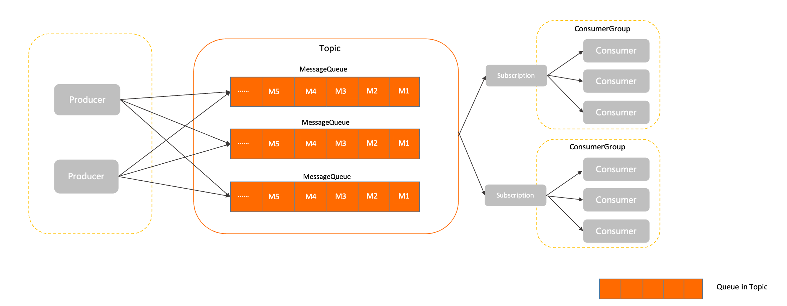

# 消息（Message） 

本文介绍 Apache RocketMQ 中消息（Message）的定义、模型关系、内部属性、行为约束及使用建议。

## 定义 


消息是 Apache RocketMQ 中的最小数据传输单元。生产者将业务数据的负载和拓展属性包装成消息发送到 Apache RocketMQ 服务端，服务端按照相关语义将消息投递到消费端进行消费。


Apache RocketMQ 的消息模型具备如下特点：

* **消息不可变性**

  消息本质上是已经产生并确定的事件，一旦产生后，消息的内容不会发生改变。即使经过传输链路的控制也不会发生变化，消费端获取的消息都是只读消息视图。

  

* **消息持久化**

  Apache RocketMQ 会默认对消息进行持久化，即将接收到的消息存储到 Apache RocketMQ 服务端的存储文件中，保证消息的可回溯性和系统故障场景下的可恢复性。

  

## 模型关系

在整个 Apache RocketMQ 的领域模型中，消息所处的流程和位置如下：

1. 消息由生产者初始化并发送到Apache RocketMQ 服务端。

2. 消息按照到达Apache RocketMQ 服务端的顺序存储到队列中。

3. 消费者按照指定的订阅关系从Apache RocketMQ 服务端中获取消息并消费。


## 消息内部属性 

**系统保留属性**

**主题名称**

* 定义：当前消息所属的主题的名称。集群内全局唯一。更多信息，请参见[主题（Topic）](./02topic.md)。

* 取值：从客户端SDK接口获取。


**消息类型**

* 定义：当前消息的类型。

* 取值：从客户端SDK接口获取。Apache RocketMQ 支持的消息类型如下：
  * Normal：[普通消息](../04-功能行为/01normalmessage.md)，消息本身无特殊语义，消息之间也没有任何关联。
  
  * FIFO：[顺序消息](../04-功能行为/03fifomessage.md)，Apache RocketMQ 通过消息分组MessageGroup标记一组特定消息的先后顺序，可以保证消息的投递顺序严格按照消息发送时的顺序。
  
  * Delay：[定时/延时消息](../04-功能行为/02delaymessage.md)，通过指定延时时间控制消息生产后不要立即投递，而是在延时间隔后才对消费者可见。
  
  * Transaction：[事务消息](../04-功能行为/04transactionmessage.md)，Apache RocketMQ 支持分布式事务消息，支持应用数据库更新和消息调用的事务一致性保障。
  

  


**消息队列**

* 定义：实际存储当前消息的队列。更多信息，请参见[队列（MessageQueue）](./03messagequeue.md)。

* 取值：由服务端指定并填充。


**消息位点**

* 定义：当前消息存储在队列中的位置。更多信息，请参见[消费进度原理](../04-功能行为/09consumerprogress.md)。

* 取值：由服务端指定并填充。取值范围：0\~long.Max。


**消息ID**

* 定义：消息的唯一标识，集群内每条消息的ID全局唯一。

* 取值：生产者客户端系统自动生成。固定为数字和大写字母组成的32位字符串。


**索引Key列表（可选）**

* 定义：消息的索引键，可通过设置不同的Key区分消息和快速查找消息。

* 取值：由生产者客户端定义。


**过滤标签Tag（可选）**

* 定义：消息的过滤标签。消费者可通过Tag对消息进行过滤，仅接收指定标签的消息。

* 取值：由生产者客户端定义。

* 约束：一条消息仅支持设置一个标签。


**定时时间（可选）**

* 定义：定时场景下，消息触发延时投递的毫秒级时间戳。更多信息，请参见[定时/延时消息](../04-功能行为/02delaymessage.md)。

* 取值：由消息生产者定义。

* 约束：最大可设置定时时长为40天。


**消息发送时间**

* 定义：消息发送时，生产者客户端系统的本地毫秒级时间戳。

* 取值：由生产者客户端系统填充。

* 说明：客户端系统时钟和服务端系统时钟可能存在偏差，消息发送时间是以客户端系统时钟为准。


**消息保存时间戳**

* 定义：消息在Apache RocketMQ 服务端完成存储时，服务端系统的本地毫秒级时间戳。 对于定时消息和事务消息，消息保存时间指的是消息生效对消费方可见的服务端系统时间。
  

* 取值：由服务端系统填充。

* 说明：客户端系统时钟和服务端系统时钟可能存在偏差，消息保留时间是以服务端系统时钟为准。


**消费重试次数**

* 定义：消息消费失败后，Apache RocketMQ 服务端重新投递的次数。每次重试后，重试次数加1。更多信息，请参见[消费重试](../04-功能行为/10consumerretrypolicy.md)。

* 取值：由服务端系统标记。首次消费，重试次数为0；消费失败首次重试时，重试次数为1。


**业务自定义属性**


* 定义：生产者可以自定义设置的扩展信息。

* 取值：由消息生产者自定义，按照字符串键值对设置。


**消息负载**

* 定义：业务消息的实际报文数据。

* 取值：由生产者负责序列化编码，按照二进制字节传输。

* 约束：请参见[参数限制](../01-基础介绍/03limits.md)。


## 行为约束 


消息大小不得超过其类型所对应的限制，否则消息会发送失败。

系统默认的消息最大限制如下：

* 普通和顺序消息：4 MB

* 事务和定时或延时消息：64 KB


## 使用建议 


**单条消息不建议传输超大负载**

作为一款消息中间件产品，Apache RocketMQ 一般传输的是都是业务事件数据。单个原子消息事件的数据大小需要严格控制，如果单条消息过大容易造成网络传输层压力，不利于异常重试和流量控制。

生产环境中如果需要传输超大负载，建议按照固定大小做报文拆分，或者结合文件存储等方法进行传输。

**消息中转时做好不可变设计**

Apache RocketMQ 服务端5.x版本中，消息本身不可编辑，消费端获取的消息都是只读消息视图。
但在历史版本3.x和4.x版本中消息不可变性没有强约束，因此如果您需要在使用过程中对消息进行中转操作，务必将消息重新初始化。

* 正确使用示例如下：

  ```java
  Message m = Consumer.receive();
  Message m2= MessageBuilder.buildFrom(m);
  Producer.send(m2);
  ```

  

* 错误使用示例如下：

  ```java
  Message m = Consumer.receive();
  m.update()；
  Producer.send(m);
  ```

  


