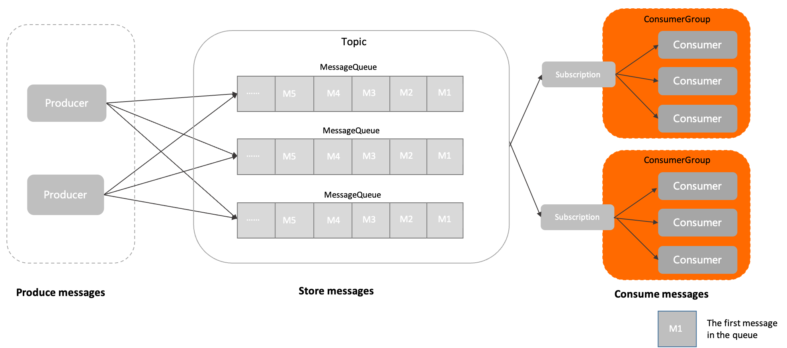

# 消费者分组（ConsumerGroup）

本文介绍 Apache RocketMQ 中消费者分组（ConsumerGroup）的定义、模型关系、内部属性、行为约束、版本兼容性及使用建议。

## 定义 

消费者分组是 Apache RocketMQ 系统中承载多个消费行为一致的消费者的负载均衡分组。

和消费者不同，消费者分组并不是运行实体，而是一个逻辑资源。在 Apache RocketMQ 中，通过消费者分组内初始化多个消费者实现消费性能的水平扩展以及高可用容灾。

在消费者分组中，统一定义以下消费行为，同一分组下的多个消费者将按照分组内统一的消费行为和负载均衡策略消费消息。

* 订阅关系：Apache RocketMQ 以消费者分组的粒度管理订阅关系，实现订阅关系的管理和追溯。具体信息，请参见[订阅关系（Subscription）](./09subscription.md)。

* 投递顺序性：Apache RocketMQ 的服务端将消息投递给消费者消费时，支持顺序投递和并发投递，投递方式在消费者分组中统一配置。具体信息，请参见[顺序消息](../04-功能行为/03fifomessage.md)。

* 消费重试策略： 消费者消费消息失败时的重试策略，包括重试次数、死信队列设置等。具体信息，请参见[消费重试](../04-功能行为/10consumerretrypolicy.md)。

## 模型关系 

在 Apache RocketMQ 的领域模型中，消费者分组的位置和流程如下：

1. 消息由生产者初始化并发送到Apache RocketMQ 服务端。

2. 消息按照到达Apache RocketMQ 服务端的顺序存储到主题的指定队列中。

3. 消费者按照指定的订阅关系从Apache RocketMQ 服务端中获取消息并消费。

## 内部属性 

**消费者分组名称**

* 定义：消费者分组的名称，用于区分不同的消费者分组。集群内全局唯一。

* 取值：消费者分组由用户设置并创建。具体命名规范，请参见[参数限制](../01-基础介绍/03limits.md)。

**投递顺序性**

* 定义：消费者消费消息时，Apache RocketMQ 向消费者客户端投递消息的顺序。

  根据不同的消费场景，Apache RocketMQ 提供顺序投递和并发投递两种方式。具体信息，请参见[顺序消息](../04-功能行为/03fifomessage.md)。

* 取值：默认投递方式为并发投递。

**消费重试策略**

* 定义：消费者消费消息失败时，系统的重试策略。消费者消费消息失败时，系统会按照重试策略，将指定消息投递给消费者重新消费。具体信息，请参见[消费重试](../04-功能行为/10consumerretrypolicy.md)。

* 取值：重试策略包括：

  * 最大重试次数：表示消息可以重新被投递的最大次数，超过最大重试次数还没被成功消费，消息将被投递至死信队列或丢弃。
  
  * 重试间隔：Apache RocketMQ 服务端重新投递消息的间隔时间。 最大重试次数和重试间隔的取值范围及默认值，请参见[参数限制](../01-基础介绍/03limits.md)。
  
* 约束：重试间隔仅在PushConsumer消费类型下有效。

**订阅关系**

* 定义：当前消费者分组关联的订阅关系集合。包括消费者订阅的主题，以及消息的过滤规则等。订阅关系由消费者动态注册到消费者分组中，Apache RocketMQ 服务端会持久化订阅关系并匹配消息的消费进度。更多信息，请参见[订阅关系（Subscription）](./09subscription.md)。

## 行为约束

在 Apache RocketMQ 领域模型中，消费者的管理通过消费者分组实现，同一分组内的消费者共同分摊消息进行消费。因此，为了保证分组内消息的正常负载和消费，

Apache RocketMQ 要求同一分组下的所有消费者以下消费行为保持一致：

* **投递顺序** 

* **消费重试策略** 

## 版本兼容性

如行为约束中所述，同一分组内所有消费者的投递顺序和消费重试策略需要保持一致。

* Apache RocketMQ 服务端5.x版本：上述消费者的消费行为从关联的消费者分组中统一获取，因此，同一分组内所有消费者的消费行为必然是一致的，客户端无需关注。

* Apache RocketMQ 服务端3.x/4.x历史版本：上述消费逻辑由消费者客户端接口定义，因此，您需要自己在消费者客户端设置时保证同一分组下的消费者的消费行为一致。

若您使用 Apache RocketMQ 服务端5.x版本，客户端使用历史版本SDK，则消费者的消费逻辑以消费者客户端接口的设置为准。

## 使用建议

**按照业务合理拆分分组**

Apache RocketMQ 的消费者和主题是多对多的关系，对于消费者分组的拆分设计，建议遵循以下原则：

* 消费者的投递顺序一致：同一消费者分组下所有消费者的消费投递顺序是相同的，统一都是顺序投递或并发投递，不同业务场景不能混用消费者分组。

* 消费者业务类型一致：一般消费者分组和主题对应，不同业务域对消息消费的要求不同，例如消息过滤属性、消费重试策略不同。因此，不同业务域主题的消费建议使用不同的消费者分组，避免一个消费者分组消费超过10个主题。

**消费者分组管理尽量避免自动化机制**

在 Apache RocketMQ 架构中，消费分组属于状态管理类的逻辑资源，每个消费分组都会涉及关联的消费状态、堆积信息、可观测指标和监控采集数据。因此，生产环境需要严格管理消费者分组资源，请勿随意进行增、删、改、查操作。

Apache RocketMQ 虽然提供了自动创建消费者分组的功能，但是建议仅在测试环境使用，生产环境请勿打开，避免产生大量消费者分组，无法管理和回收，且浪费系统资源。

