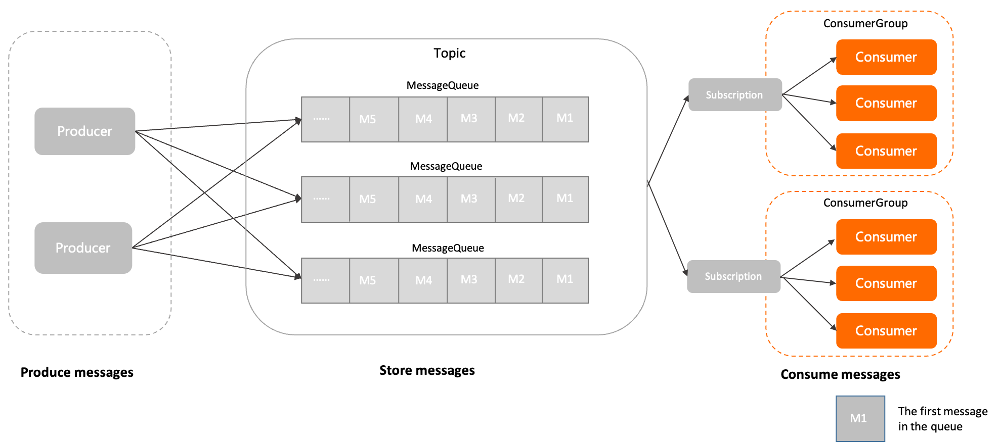

# 消费者（Consumer）

本文介绍 Apache RocketMQ 中消费者（Consumer）的定义、模型关系、内部属性、行为约束、版本兼容性及使用建议。

## 定义 


消费者是 Apache RocketMQ 中用来接收并处理消息的运行实体。 消费者通常被集成在业务系统中，从 Apache RocketMQ 服务端获取消息，并将消息转化成业务可理解的信息，供业务逻辑处理。

在消息消费端，可以定义如下传输行为：

* 消费者身份：消费者必须关联一个指定的消费者分组，以获取分组内统一定义的行为配置和消费状态。

* 消费者类型：Apache RocketMQ 面向不同的开发场景提供了多样的消费者类型，包括PushConsumer类型、SimpleConsumer类型、PullConsumer类型（仅推荐流处理场景使用）等。具体信息，请参见[消费者分类](../04-功能行为/06consumertype.md)。

* 消费者本地运行配置：消费者根据不同的消费者类型，控制消费者客户端本地的运行配置。例如消费者客户端的线程数，消费并发度等，实现不同的传输效果。


## 模型关系 


在 Apache RocketMQ 的领域模型中，消费者的位置和流程如下：

1. 消息由生产者初始化并发送到Apache RocketMQ 服务端。

2. 消息按照到达Apache RocketMQ 服务端的顺序存储到主题的指定队列中。

3. 消费者按照指定的订阅关系从Apache RocketMQ 服务端中获取消息并消费。


## 内部属性

**消费者分组名称**

* 定义：当前消费者关联的消费者分组名称，消费者必须关联到指定的消费者分组，通过消费者分组获取消费行为。更多信息，请参见[消费者分组（ConsumerGroup）](./07consumergroup.md)。

* 取值：消费者分组为Apache RocketMQ 的逻辑资源，需要您提前通过控制台或OpenAPI创建。具体命名格式，请参见[使用限制](../01-基础介绍/03limits.md)。


**客户端ID**

* 定义：消费者客户端的标识，用于区分不同的消费者。集群内全局唯一。

* 取值：客户端ID由Apache RocketMQ 的SDK自动生成，主要用于日志查看、问题定位等运维场景，不支持修改。


**通信参数**

* 接入点信息 **（必选）** ：连接服务端的接入地址，用于识别服务端集群。 接入点必须按格式配置，建议使用域名，避免使用IP地址，防止节点变更无法进行热点迁移。
  
* 身份认证信息 **（可选）** ：客户端用于身份验证的凭证信息。 仅在服务端开启身份识别和认证时需要传输。
  
* 请求超时时间 **（可选）** ：客户端网络请求调用的超时时间。取值范围和默认值，请参见[参数限制](../01-基础介绍/03limits.md)。


**预绑定订阅关系列表**

* 定义：指定消费者的订阅关系列表。 Apache RocketMQ 服务端可在消费者初始化阶段，根据预绑定的订阅关系列表对目标主题进行权限及合法性校验，无需等到应用启动后才能校验。


* 取值：建议在消费者初始化阶段明确订阅关系即要订阅的主题列表，若未设置，或订阅的主题动态变更，Apache RocketMQ 会对目标主题进行动态补充校验。


**消费监听器**

* 定义：Apache RocketMQ 服务端将消息推送给消费者后，消费者调用消息消费逻辑的监听器。

* 取值：由消费者客户端本地配置。

* 约束：使用PushConsumer类型的消费者消费消息时，消费者客户端必须设置消费监听器。消费者类型的具体信息，请参见[消费者分类](../04-功能行为/06consumertype.md)。


## 行为约束 


在 Apache RocketMQ 领域模型中，消费者的管理通过消费者分组实现，同一分组内的消费者共同分摊消息进行消费。因此，为了保证分组内消息的正常负载和消费，

Apache RocketMQ 要求同一分组下的所有消费者以下消费行为保持一致：

* **投递顺序** 

* **消费重试策略** 


## 版本兼容性 


如行为约束中所述，同一分组内所有消费者的投递顺序和消费重试策略需要保持一致。

* Apache RocketMQ 服务端5.x版本：上述消费者的消费行为从关联的消费者分组中统一获取，因此，同一分组内所有消费者的消费行为必然是一致的，客户端无需关注。

* Apache RocketMQ 服务端3.x/4.x历史版本：上述消费逻辑由消费者客户端接口定义，因此，您需要自己在消费者客户端设置时保证同一分组下的消费者的消费行为一致。

若您使用 Apache RocketMQ 服务端5.x版本，客户端使用历史版本SDK，则消费者的消费逻辑以消费者客户端接口的设置为准。

## 使用建议 


**不建议在单一进程内创建大量消费者**

Apache RocketMQ 的消费者在通信协议层面支持非阻塞传输模式，网络通信效率较高，并且支持多线程并发访问。因此，大部分场景下，单一进程内同一个消费分组只需要初始化唯一的一个消费者即可，开发过程中应避免以相同的配置初始化多个消费者。

**不建议频繁创建和销毁消费者**

Apache RocketMQ 的消费者是可以重复利用的底层资源，类似数据库的连接池。因此不需要在每次接收消息时动态创建消费者，且在消费完成后销毁消费者。这样频繁地创建销毁会在服务端产生大量短连接请求，严重影响系统性能。

* 正确示例

  ```java
  Consumer c = ConsumerBuilder.build();
  for (int i =0;i<n;i++){
        Message m= c.receive();
        //process message
      }
  c.shutdown();
  ```
  
  
  
* 典型错误示例

  ```java
  for (int i =0;i<n;i++){
      Consumer c = ConsumerBuilder.build();
      Message m= c.receive();
      //process message
      c.shutdown();
    }
  ```
  


