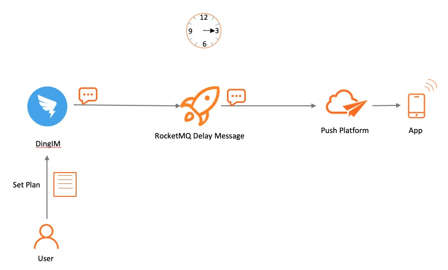

# 定时/延时消息

定时/延时消息为 Apache RocketMQ 中的高级特性消息，本文为您介绍定时/延时消息的应用场景、功能原理、使用限制、使用方法和使用建议。
:::note

定时消息和延时消息本质相同，都是服务端根据消息设置的定时时间在某一固定时刻将消息投递给消费者消费。因此，下文统一用定时消息描述。

:::
## 应用场景

在分布式定时调度触发、任务超时处理等场景，需要实现精准、可靠的定时事件触发。使用 Apache RocketMQ 的定时消息可以简化定时调度任务的开发逻辑，实现高性能、可扩展、高可靠的定时触发能力。

**典型场景一：分布式定时调度**


在分布式定时调度场景下，需要实现各类精度的定时任务，例如每天5点执行文件清理，每隔2分钟触发一次消息推送等需求。传统基于数据库的定时调度方案在分布式场景下，性能不高，实现复杂。基于 Apache RocketMQ 的定时消息可以封装出多种类型的定时触发器。

**典型场景二：任务超时处理**


以电商交易场景为例，订单下单后暂未支付，此时不可以直接关闭订单，而是需要等待一段时间后才能关闭订单。使用 Apache RocketMQ 定时消息可以实现超时任务的检查触发。

基于定时消息的超时任务处理具备如下优势：

* 精度高、开发门槛低：基于消息通知方式不存在定时阶梯间隔。可以轻松实现任意精度事件触发，无需业务去重。

* 高性能可扩展：传统的数据库扫描方式较为复杂，需要频繁调用接口扫描，容易产生性能瓶颈。 Apache RocketMQ 的定时消息具有高并发和水平扩展的能力。


## 功能原理

**什么是定时消息**

定时消息是 Apache RocketMQ 提供的一种高级消息类型，消息被发送至服务端后，在指定时间后才能被消费者消费。通过设置一定的定时时间可以实现分布式场景的延时调度触发效果。

**定时时间设置原则**

* Apache RocketMQ 定时消息设置的定时时间是一个预期触发的系统时间戳，延时时间也需要转换成当前系统时间后的某一个时间戳，而不是一段延时时长。

* 定时时间的格式为毫秒级的Unix时间戳，您需要将要设置的时刻转换成时间戳形式。具体方式，请参见[Unix时间戳转换工具](https://www.unixtimestamp.com/)。

* 定时时间必须设置在定时时长范围内，超过范围则定时不生效，服务端会立即投递消息。

* 定时时长最大值默认为24小时，不支持自定义修改，更多信息，请参见[参数限制](../01-introduction/03limits.md)。

* 定时时间必须设置为当前时间之后，若设置到当前时间之前，则定时不生效，服务端会立即投递消息。


**示例如下：**

* 定时消息：例如，当前系统时间为2022-06-09 17:30:00，您希望消息在下午19:20:00定时投递，则定时时间为2022-06-09 19:20:00，转换成时间戳格式为1654773600000。

* 延时消息：例如，当前系统时间为2022-06-09 17:30:00，您希望延时1个小时后投递消息，则您需要根据当前时间和延时时长换算成定时时刻，即消息投递时间为2022-06-09 18:30:00，转换为时间戳格式为1654770600000。

**定时消息生命周期**


* 初始化：消息被生产者构建并完成初始化，待发送到服务端的状态。

* 定时中：消息被发送到服务端，和普通消息不同的是，服务端不会直接构建消息索引，而是会将定时消息单独存储在定时存储系统中，等待定时时刻到达。

* 待消费：定时时刻到达后，服务端将消息重新写入普通存储引擎，对下游消费者可见，等待消费者消费的状态。

* 消费中：消息被消费者获取，并按照消费者本地的业务逻辑进行处理的过程。 此时服务端会等待消费者完成消费并提交消费结果，如果一定时间后没有收到消费者的响应，Apache RocketMQ会对消息进行重试处理。具体信息，请参见[消费重试](./10consumerretrypolicy.md)。

* 消费提交：消费者完成消费处理，并向服务端提交消费结果，服务端标记当前消息已经被处理（包括消费成功和失败）。 Apache RocketMQ 默认支持保留所有消息，此时消息数据并不会立即被删除，只是逻辑标记已消费。消息在保存时间到期或存储空间不足被删除前，消费者仍然可以回溯消息重新消费。

* 消息删除：Apache RocketMQ按照消息保存机制滚动清理最早的消息数据，将消息从物理文件中删除。更多信息，请参见[消息存储和清理机制](./11messagestorepolicy.md)。


## 使用限制

**消息类型一致性**

定时消息仅支持在 MessageType为Delay 的主题内使用，即定时消息只能发送至类型为定时消息的主题中，发送的消息的类型必须和主题的类型一致。

**定时精度约束**

Apache RocketMQ 定时消息的定时时长参数精确到毫秒级，但是默认精度为1000ms，即定时消息为秒级精度。

Apache RocketMQ 定时消息的状态支持持久化存储，系统由于故障重启后，仍支持按照原来设置的定时时间触发消息投递。若存储系统异常重启，可能会导致定时消息投递出现一定延迟。

## 使用示例

和普通消息相比，定时消费发送时，必须设置定时触发的目标时间戳。

以Java语言为例，使用定时消息示例参考如下：

```java
        //定时/延时消息发送
        MessageBuilder messageBuilder = null;
        //以下示例表示：延迟时间为10分钟之后的Unix时间戳。
        Long deliverTimeStamp = System.currentTimeMillis() + 10L * 60 * 1000;
        Message message = messageBuilder.setTopic("topic")
                //设置消息索引键，可根据关键字精确查找某条消息。
                .setKeys("messageKey")
                //设置消息Tag，用于消费端根据指定Tag过滤消息。
                .setTag("messageTag")
                .setDeliveryTimestamp(deliverTimeStamp)
                //消息体
                .setBody("messageBody".getBytes())
                .build();
        try {
            //发送消息，需要关注发送结果，并捕获失败等异常。
            SendReceipt sendReceipt = producer.send(message);
            System.out.println(sendReceipt.getMessageId());
        } catch (ClientException e) {
            e.printStackTrace();
        }
        //消费示例一：使用PushConsumer消费定时消息，只需要在消费监听器处理即可。
        MessageListener messageListener = new MessageListener() {
            @Override
            public ConsumeResult consume(MessageView messageView) {
                System.out.println(messageView.getDeliveryTimestamp());
                //根据消费结果返回状态。
                return ConsumeResult.SUCCESS;
            }
        };
        //消费示例二：使用SimpleConsumer消费定时消息，主动获取消息进行消费处理并提交消费结果。
        List<MessageView> messageViewList = null;
        try {
            messageViewList = simpleConsumer.receive(10, Duration.ofSeconds(30));
            messageViewList.forEach(messageView -> {
                System.out.println(messageView);
                //消费处理完成后，需要主动调用ACK提交消费结果。
                try {
                    simpleConsumer.ack(messageView);
                } catch (ClientException e) {
                    e.printStackTrace();
                }
            });
        } catch (ClientException e) {
            //如果遇到系统流控等原因造成拉取失败，需要重新发起获取消息请求。
            e.printStackTrace();
        }
```


## 使用建议

**避免大量相同定时时刻的消息**

定时消息的实现逻辑需要先经过定时存储等待触发，定时时间到达后才会被投递给消费者。因此，如果将大量定时消息的定时时间设置为同一时刻，则到达该时刻后会有大量消息同时需要被处理，会造成系统压力过大，导致消息分发延迟，影响定时精度。
