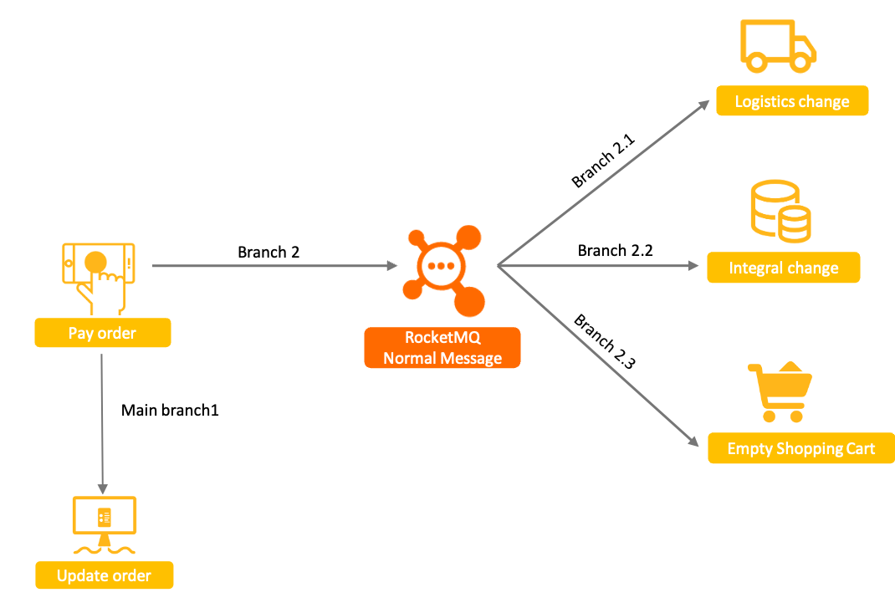
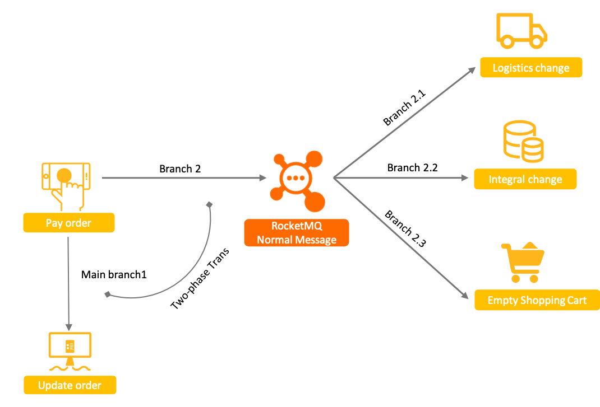

# 事务消息

事务消息为 Apache RocketMQ 中的高级特性消息，本文为您介绍事务消息的应用场景、功能原理、使用限制、使用方法和使用建议。

## 应用场景

**分布式事务的诉求**

分布式系统调用的特点为一个核心业务逻辑的执行，同时需要调用多个下游业务进行处理。因此，如何保证核心业务和多个下游业务的执行结果完全一致，是分布式事务需要解决的主要问题。


以电商交易场景为例，用户支付订单这一核心操作的同时会涉及到下游物流发货、积分变更、购物车状态清空等多个子系统的变更。当前业务的处理分支包括：

* 主分支订单系统状态更新：由未支付变更为支付成功。

* 物流系统状态新增：新增待发货物流记录，创建订单物流记录。

* 积分系统状态变更：变更用户积分，更新用户积分表。

* 购物车系统状态变更：清空购物车，更新用户购物车记录。

**传统XA事务方案：性能不足**

为了保证上述四个分支的执行结果一致性，典型方案是基于XA协议的分布式事务系统来实现。将四个调用分支封装成包含四个独立事务分支的大事务。基于XA分布式事务的方案可以满足业务处理结果的正确性，但最大的缺点是多分支环境下资源锁定范围大，并发度低，随着下游分支的增加，系统性能会越来越差。

**基于普通消息方案：一致性保障困难**

将上述基于XA事务的方案进行简化，将订单系统变更作为本地事务，剩下的系统变更作为普通消息的下游来执行，事务分支简化成普通消息+订单表事务，充分利用消息异步化的能力缩短链路，提高并发度。


该方案中消息下游分支和订单系统变更的主分支很容易出现不一致的现象，例如：

* 消息发送成功，订单没有执行成功，需要回滚整个事务。

* 订单执行成功，消息没有发送成功，需要额外补偿才能发现不一致。

* 消息发送超时未知，此时无法判断需要回滚订单还是提交订单变更。

**基于Apache RocketMQ分布式事务消息：支持最终一致性**

上述普通消息方案中，普通消息和订单事务无法保证一致的原因，本质上是由于普通消息无法像单机数据库事务一样，具备提交、回滚和统一协调的能力。

而基于Apache RocketMQ实现的分布式事务消息功能，在普通消息基础上，支持二阶段的提交能力。将二阶段提交和本地事务绑定，实现全局提交结果的一致性。


Apache RocketMQ事务消息的方案，具备高性能、可扩展、业务开发简单的优势。具体事务消息的原理和流程，请参见下文的功能原理。

## 功能原理

**什么是事务消息**

事务消息是 Apache RocketMQ 提供的一种高级消息类型，支持在分布式场景下保障消息生产和本地事务的最终一致性。

**事务消息处理流程**

事务消息交互流程如下图所示。

1. 生产者将消息发送至Apache RocketMQ服务端。

2. Apache RocketMQ服务端将消息持久化成功之后，向生产者返回Ack确认消息已经发送成功，此时消息被标记为"暂不能投递"，这种状态下的消息即为半事务消息。

3. 生产者开始执行本地事务逻辑。

4. 生产者根据本地事务执行结果向服务端提交二次确认结果（Commit或是Rollback），服务端收到确认结果后处理逻辑如下：
   * 二次确认结果为Commit：服务端将半事务消息标记为可投递，并投递给消费者。
   
   * 二次确认结果为Rollback：服务端将回滚事务，不会将半事务消息投递给消费者。
   
5. 在断网或者是生产者应用重启的特殊情况下，若服务端未收到发送者提交的二次确认结果，或服务端收到的二次确认结果为Unknown未知状态，经过固定时间后，服务端将对消息生产者即生产者集群中任一生产者实例发起消息回查。
   **说明** 服务端回查的间隔时间和最大回查次数，请参见[参数限制](../01-introduction/03limits.md)。

6. 生产者收到消息回查后，需要检查对应消息的本地事务执行的最终结果。

7. 生产者根据检查到的本地事务的最终状态再次提交二次确认，服务端仍按照步骤4对半事务消息进行处理。


**事务消息生命周期**


* 初始化：半事务消息被生产者构建并完成初始化，待发送到服务端的状态。

* 事务待提交：半事务消息被发送到服务端，和普通消息不同，并不会直接被服务端持久化，而是会被单独存储到事务存储系统中，等待第二阶段本地事务返回执行结果后再提交。此时消息对下游消费者不可见。

* 消息回滚：第二阶段如果事务执行结果明确为回滚，服务端会将半事务消息回滚，该事务消息流程终止。

* 提交待消费：第二阶段如果事务执行结果明确为提交，服务端会将半事务消息重新存储到普通存储系统中，此时消息对下游消费者可见，等待被消费者获取并消费。

* 消费中：消息被消费者获取，并按照消费者本地的业务逻辑进行处理的过程。 此时服务端会等待消费者完成消费并提交消费结果，如果一定时间后没有收到消费者的响应，Apache RocketMQ会对消息进行重试处理。具体信息，请参见[消费重试](./10consumerretrypolicy.md)。

* 消费提交：消费者完成消费处理，并向服务端提交消费结果，服务端标记当前消息已经被处理（包括消费成功和失败）。 Apache RocketMQ默认支持保留所有消息，此时消息数据并不会立即被删除，只是逻辑标记已消费。消息在保存时间到期或存储空间不足被删除前，消费者仍然可以回溯消息重新消费。

* 消息删除：Apache RocketMQ按照消息保存机制滚动清理最早的消息数据，将消息从物理文件中删除。更多信息，请参见[消息存储和清理机制](./11messagestorepolicy.md)。


## 使用限制

**消息类型一致性**

事务消息仅支持在 MessageType 为 Transaction 的主题内使用，即事务消息只能发送至类型为事务消息的主题中，发送的消息的类型必须和主题的类型一致。

**消费事务性**

Apache RocketMQ 事务消息保证本地主分支事务和下游消息发送事务的一致性，但不保证消息消费结果和上游事务的一致性。因此需要下游业务分支自行保证消息正确处理，建议消费端做好[消费重试](./10consumerretrypolicy.md)，如果有短暂失败可以利用重试机制保证最终处理成功。

**中间状态可见性**

Apache RocketMQ 事务消息为最终一致性，即在消息提交到下游消费端处理完成之前，下游分支和上游事务之间的状态会不一致。因此，事务消息仅适合接受异步执行的事务场景。

**事务超时机制**

Apache RocketMQ 事务消息的命周期存在超时机制，即半事务消息被生产者发送服务端后，如果在指定时间内服务端无法确认提交或者回滚状态，则消息默认会被回滚。事务超时时间，请参见[参数限制](../01-introduction/03limits.md)。

## 使用示例

事务消息相比普通消息发送时需要修改以下几点：

* 发送事务消息前，需要开启事务并关联本地的事务执行。

* 为保证事务一致性，在构建生产者时，必须设置事务检查器和预绑定事务消息发送的主题列表，客户端内置的事务检查器会对绑定的事务主题做异常状态恢复。

**创建或更新Topic为事务类型**

>  NORMAL类型Topic不支持TRANSACTION类型消息，生产消息会报错。

```bash
./bin/mqadmin updatetopic -n localhost:9876 -t TestTopic -c DefaultCluster -a +message.type=TRANSACTION
```

以Java语言为例，使用事务消息示例参考如下：

```java
    //演示demo，模拟订单表查询服务，用来确认订单事务是否提交成功。
    private static boolean checkOrderById(String orderId) {
        return true;
    }
    //演示demo，模拟本地事务的执行结果。
    private static boolean doLocalTransaction() {
        return true;
    }
    public static void main(String[] args) throws ClientException {
        ClientServiceProvider provider = new ClientServiceProvider();
        MessageBuilder messageBuilder = new MessageBuilder();
        //构造事务生产者：事务消息需要生产者构建一个事务检查器，用于检查确认异常半事务的中间状态。
        Producer producer = provider.newProducerBuilder()
                .setTransactionChecker(messageView -> {
                    /**
                     * 事务检查器一般是根据业务的ID去检查本地事务是否正确提交还是回滚，此处以订单ID属性为例。
                     * 在订单表找到了这个订单，说明本地事务插入订单的操作已经正确提交；如果订单表没有订单，说明本地事务已经回滚。
                     */
                    final String orderId = messageView.getProperties().get("OrderId");
                    if (Strings.isNullOrEmpty(orderId)) {
                        // 错误的消息，直接返回Rollback。
                        return TransactionResolution.ROLLBACK;
                    }
                    return checkOrderById(orderId) ? TransactionResolution.COMMIT : TransactionResolution.ROLLBACK;
                })
                .build();
        //开启事务分支。
        final Transaction transaction;
        try {
            transaction = producer.beginTransaction();
        } catch (ClientException e) {
            e.printStackTrace();
            //事务分支开启失败，直接退出。
            return;
        }
        Message message = messageBuilder.setTopic("topic")
                //设置消息索引键，可根据关键字精确查找某条消息。
                .setKeys("messageKey")
                //设置消息Tag，用于消费端根据指定Tag过滤消息。
                .setTag("messageTag")
                //一般事务消息都会设置一个本地事务关联的唯一ID，用来做本地事务回查的校验。
                .addProperty("OrderId", "xxx")
                //消息体。
                .setBody("messageBody".getBytes())
                .build();
        //发送半事务消息
        final SendReceipt sendReceipt;
        try {
            sendReceipt = producer.send(message, transaction);
        } catch (ClientException e) {
            //半事务消息发送失败，事务可以直接退出并回滚。
            return;
        }
        /**
         * 执行本地事务，并确定本地事务结果。
         * 1. 如果本地事务提交成功，则提交消息事务。
         * 2. 如果本地事务提交失败，则回滚消息事务。
         * 3. 如果本地事务未知异常，则不处理，等待事务消息回查。
         *
         */
        boolean localTransactionOk = doLocalTransaction();
        if (localTransactionOk) {
            try {
                transaction.commit();
            } catch (ClientException e) {
                // 业务可以自身对实时性的要求选择是否重试，如果放弃重试，可以依赖事务消息回查机制进行事务状态的提交。
                e.printStackTrace();
            }
        } else {
            try {
                transaction.rollback();
            } catch (ClientException e) {
                // 建议记录异常信息，回滚异常时可以无需重试，依赖事务消息回查机制进行事务状态的提交。
                e.printStackTrace();
            }
        }
    }
```

## 使用建议

**避免大量未决事务导致超时**

Apache RocketMQ支持在事务提交阶段异常的情况下发起事务回查，保证事务一致性。但生产者应该尽量避免本地事务返回未知结果。大量的事务检查会导致系统性能受损，容易导致事务处理延迟。

**正确处理"进行中"的事务**

消息回查时，对于正在进行中的事务不要返回Rollback或Commit结果，应继续保持Unknown的状态。 一般出现消息回查时事务正在处理的原因为：事务执行较慢，消息回查太快。解决方案如下：

* 将第一次事务回查时间设置较大一些，但可能导致依赖回查的事务提交延迟较大。

* 程序能正确识别正在进行中的事务。


