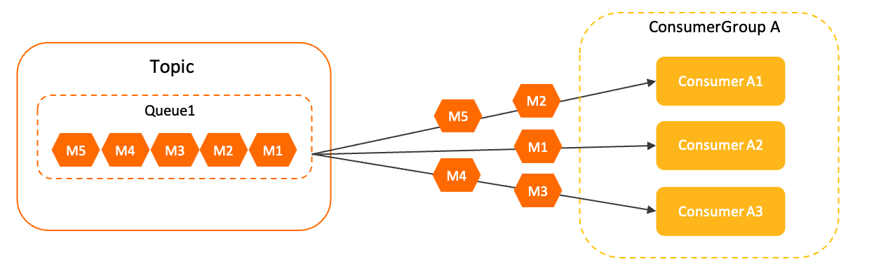
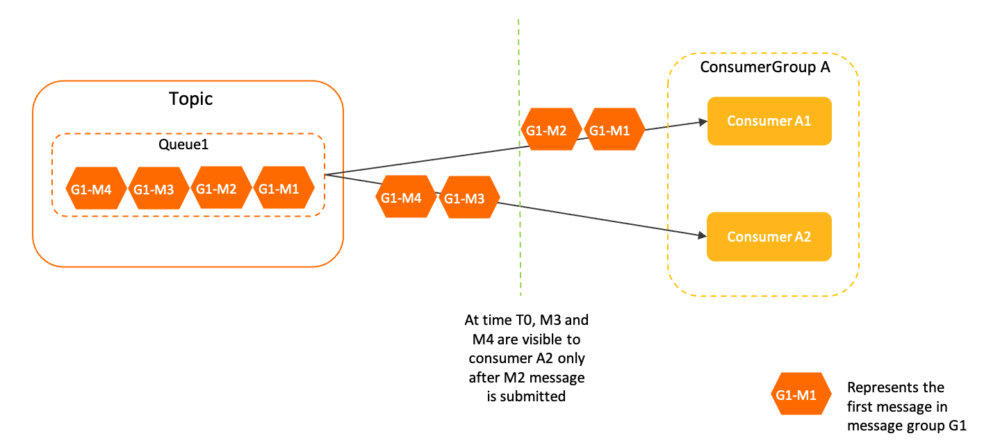
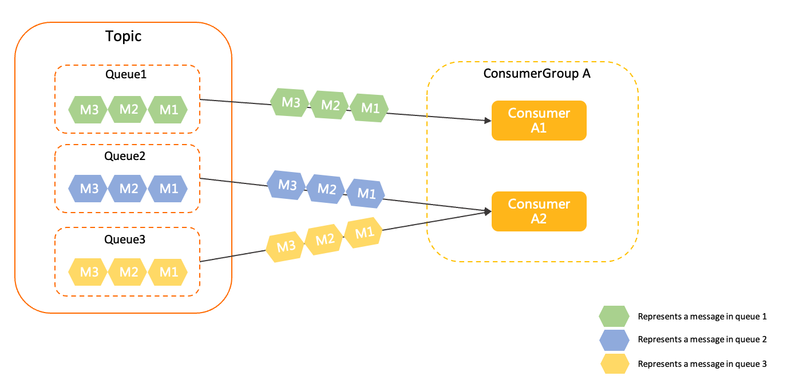

# 消费者负载均衡

消费者从 Apache RocketMQ 获取消息消费时，通过消费者负载均衡策略，可将主题内的消息分配给指定消费者分组中的多个消费者共同分担，提高消费并发能力和消费者的水平扩展能力。本文介绍 Apache RocketMQ 消费者的负载均衡策略。

## 背景信息

了解消费者负载均衡策略，可以帮助您解决以下问题：

* 消息消费处理的容灾策略：您可以根据消费者负载均衡策略，明确当局部节点出现故障时，消息如何进行消费重试和容灾切换。

* 消息消费的顺序性机制：通过消费者负载均衡策略，您可以进一步了解消息消费时，如何保证同一消息组内消息的先后顺序。

* 消息分配的水平拆分策略：了解消费者负载均衡策略，您可以明确消息消费压力如何被分配到不同节点，有针对性地进行流量迁移和水平扩缩容。


## 广播消费和共享消费

在 Apache RocketMQ 领域模型中，同一条消息支持被多个消费者分组订阅，同时，对于每个消费者分组可以初始化多个消费者。您可以根据消费者分组和消费者的不同组合，实现以下两种不同的消费效果：

* **消费组间广播消费** ：如上图所示，每个消费者分组只初始化唯一一个消费者，每个消费者可消费到消费者分组内所有的消息，各消费者分组都订阅相同的消息，以此实现单客户端级别的广播一对多推送效果。

  该方式一般可用于网关推送、配置推送等场景。
  

* **消费组内共享消费** ：如上图所示，每个消费者分组下初始化了多个消费者，这些消费者共同分担消费者分组内的所有消息，实现消费者分组内流量的水平拆分和均衡负载。

  该方式一般可用于微服务解耦场景。


## 什么是消费者负载均衡

如上文所述，消费组间广播消费场景下，每个消费者分组内只有一个消费者，因此不涉及消费者的负载均衡。

消费组内共享消费场景下，消费者分组内多个消费者共同分担消息，消息按照哪种逻辑分配给哪个消费者，就是由消费者负载均衡策略所决定的。

根据消费者类型的不同，消费者负载均衡策略分为以下两种模式：

* [消息粒度负载均衡](#section-x2b-2cu-gpf)：PushConsumer和SimpleConsumer默认负载策略

* [队列粒度负载均衡](#section-n9m-6xy-y77)：PullConsumer默认负载策略


## 消息粒度负载均衡

**使用范围**

对于PushConsumer和SimpleConsumer类型的消费者，默认且仅使用消息粒度负载均衡策略。

:::note
上述说明是指5.0 SDK下，PushConsumer默认使用消息粒度负载均衡，对于3.x/4.x等Remoting协议SDK 仍然使用了队列粒度负载均衡。业务集成如无特殊需求，建议使用新版本机制。
:::

**策略原理**

消息粒度负载均衡策略中，同一消费者分组内的多个消费者将按照消息粒度平均分摊主题中的所有消息，即同一个队列中的消息，可被平均分配给多个消费者共同消费。


如上图所示，消费者分组Group A中有三个消费者A1、A2和A3，这三个消费者将共同消费主题中同一队列Queue1中的多条消息。
**注意** 消息粒度负载均衡策略保证同一个队列的消息可以被多个消费者共同处理，但是该策略使用的消息分配算法结果是随机的，并不能指定消息被哪一个特定的消费者处理。

消息粒度的负载均衡机制，是基于内部的单条消息确认语义实现的。消费者获取某条消息后，服务端会将该消息加锁，保证这条消息对其他消费者不可见，直到该消息消费成功或消费超时。因此，即使多个消费者同时消费同一队列的消息，服务端也可保证消息不会被多个消费者重复消费。

**顺序消息负载机制**

在顺序消息中，消息的顺序性指的是同一消息组内的多个消息之间的先后顺序。因此，顺序消息场景下，消息粒度负载均衡策略还需要保证同一消息组内的消息，按照服务端存储的先后顺序进行消费。不同消费者处理同一个消息组内的消息时，会严格按照先后顺序锁定消息状态，确保同一消息组的消息串行消费。


如上图所述，队列Queue1中有4条顺序消息，这4条消息属于同一消息组G1，存储顺序由M1到M4。在消费过程中，前面的消息M1、M2被消费者Consumer A1处理时，只要消费状态没有提交，消费者A2是无法并行消费后续的M3、M4消息的，必须等前面的消息提交消费状态后才能消费后面的消息。

**策略特点**

相对于队列粒度负载均衡策略，消息粒度负载均衡策略有以下特点：

* 消费分摊更均衡传统队列级的负载均衡策略中，如果队列数量和消费者数量不均衡，则可能会出现部分消费者空闲，或部分消费者处理过多消息的情况。消息粒度负载均衡策略无需关注消费者和队列的相对数量，能够更均匀地分摊消息。

* 对非对等消费者更友好对于线上生产环境，由于网络机房分区延迟、消费者物理资源规格不一致等原因，消费者的处理能力可能会不一致，如果按照队列分配消息，则可能出现部分消费者消息堆积、部分消费者空闲的情况。消息粒度负载均衡策略按需分配，消费者处理任务更均衡。

* 队列分配运维更方便传统基于绑定队列的负载均衡策略，必须保证队列数量大于等于消费者数量，以免产生部分消费者获取不到队列出现空转的情况，而消息粒度负载均衡策略则无需关注队列数。


**适用场景**

消息粒度消费负载均衡策略下，同一队列内的消息离散地分布于多个消费者，适用于绝大多数在线事件处理的场景。只需要基本的消息处理能力，对消息之间没有批量聚合的诉求。而对于流式处理、聚合计算场景，需要明确地对消息进行聚合、批处理时，更适合使用队列粒度的负载均衡策略。

**使用示例**

消息粒度负载均衡策略不需要额外设置，对于PushConsumer和SimpleConsumer消费者类型默认启用。

```java
SimpleConsumer simpleConsumer = null;
        //消费示例一：使用PushConsumer消费普通消息，只需要在消费监听器处理即可，无需关注消息负载均衡。
        MessageListener messageListener = new MessageListener() {
            @Override
            public ConsumeResult consume(MessageView messageView) {
                System.out.println(messageView);
                //根据消费结果返回状态。
                return ConsumeResult.SUCCESS;
            }
        };
        //消费示例二：使用SimpleConsumer消费普通消息，主动获取消息处理并提交。会按照订阅的主题自动获取，无需关注消息负载均衡。
        List<MessageView> messageViewList = null;
        try {
            messageViewList = simpleConsumer.receive(10, Duration.ofSeconds(30));
            messageViewList.forEach(messageView -> {
                System.out.println(messageView);
                //消费处理完成后，需要主动调用ACK提交消费结果。
                try {
                    simpleConsumer.ack(messageView);
                } catch (ClientException e) {
                    e.printStackTrace();
                }
            });
        } catch (ClientException e) {
            //如果遇到系统流控等原因造成拉取失败，需要重新发起获取消息请求。
            e.printStackTrace();
        }
            
```


## 队列粒度负载均衡

**使用范围**

对于历史版本（服务端4.x/3.x版本）的消费者，包括PullConsumer、DefaultPushConsumer、DefaultPullConsumer、LitePullConsumer等，默认且仅能使用队列粒度负载均衡策略。

**策略原理**

队列粒度负载均衡策略中，同一消费者分组内的多个消费者将按照队列粒度消费消息，即每个队列仅被一个消费者消费。


如上图所示，主题中的三个队列Queue1、Queue2、Queue3被分配给消费者分组中的两个消费者，每个队列只能分配给一个消费者消费，该示例中由于队列数大于消费者数，因此，消费者A2被分配了两个队列。若队列数小于消费者数量，可能会出现部分消费者无绑定队列的情况。

队列粒度的负载均衡，基于队列数量、消费者数量等运行数据进行统一的算法分配，将每个队列绑定到特定的消费者，然后每个消费者按照取消息\>提交消费位点\>持久化消费位点的消费语义处理消息，取消息过程不提交消费状态，因此，为了避免消息被多个消费者重复消费，每个队列仅支持被一个消费者消费。
:::note
队列粒度负载均衡策略保证同一个队列仅被一个消费者处理，该策略的实现依赖消费者和服务端的信息协商机制，Apache RocketMQ 并不能保证协商结果完全强一致。因此，在消费者数量、队列数量发生变化时，可能会出现短暂的队列分配结果不一致，从而导致少量消息被重复处理。
:::


**策略特点**

相对于消息粒度负载均衡策略，队列粒度负载均衡策略分配粒度较大，不够灵活。但该策略在流式处理场景下有天然优势，能够保证同一队列的消息被相同的消费者处理，对于批量处理、聚合处理更友好。

**适用场景**

队列粒度负载均衡策略适用于流式计算、数据聚合等需要明确对消息进行聚合、批处理的场景。

**使用示例**

队列粒度负载均衡策略不需要额外设置，对于历史版本（服务端4.x/3.x版本）的消费者类型PullConsumer默认启用。

具体示例代码，请访问[RocketMQ代码库](https://github.com/apache/rocketmq/blob/develop/example/src/main/java/org/apache/rocketmq/example/simple/LitePullConsumerAssign.java)获取。

## 版本兼容性

消息粒度的负载均衡策略从 Apache RocketMQ 服务端5.0版本开始支持，历史版本4.x/3.x版本仅支持队列粒度的负载均衡策略。

当您使用的 Apache RocketMQ 服务端版本为5.x版本时，两种消费者负载均衡策略均支持，具体生效的负载均衡策略依客户端版本和消费者类型而定。

## 使用建议

**针对消费逻辑做消息幂等**

无论是消息粒度负载均衡策略还是队列粒度负载均衡策略，在消费者上线或下线、服务端扩缩容等场景下，都会触发短暂的重新负载均衡动作。此时可能会存在短暂的负载不一致情况，出现少量消息重复的现象。因此，需要在下游消费逻辑中做好消息幂等去重处理。
