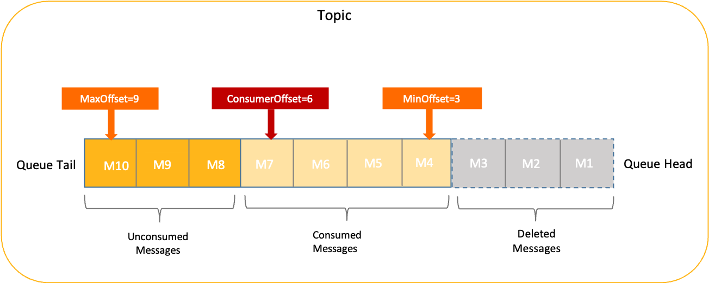

# 消息存储和清理机制

本文为您介绍 Apache RocketMQ 中消息的存储机制，包括消息的存储粒度、判断依据及后续处理策略等。

## 背景信息

参考 Apache RocketMQ 中[队列](../03-domainModel/03messagequeue.md)的定义，消息按照达到服务器的先后顺序被存储到队列中，理论上每个队列都支持无限存储。

但是在实际部署场景中，服务端节点的物理存储空间有限，消息无法做到永久存储。因此，在实际使用中需要考虑以下问题，消息在服务端中的存储以什么维度为判定条件？消息存储以什么粒度进行管理？消息存储超过限制后如何处理？这些问题都是由消息存储和过期清理机制来定义的。

了解消息存储和过期清理机制，可以从以下方面帮助您更好的进行运维管理：

* 提供消息存储时间SLA，为业务提供安全冗余空间：消息存储时间的承诺本质上代表业务侧可以自由获取消息的时间范围。对于消费时间长、消息堆积、故障恢复等场景非常关键。

* 评估和控制存储成本：Apache RocketMQ 消息一般存储于磁盘介质上，您可以通过存储机制评估消息存储空间，提前预留存储资源。

## 消息存储机制 

**原理机制**

Apache RocketMQ 使用存储时长作为消息存储的依据，即每个节点对外承诺消息的存储时长。在存储时长范围内的消息都会被保留，无论消息是否被消费；超过时长限制的消息则会被清理掉。

消息存储机制主要定义以下关键问题：

* 消息存储管理粒度：Apache RocketMQ 按存储节点管理消息的存储时长，并不是按照主题或队列粒度来管理。

* 消息存储判断依据：消息存储按照存储时间作为判断依据，相对于消息数量、消息大小等条件，使用存储时间作为判断依据，更利于业务方对消息数据的价值进行评估。

* 消息存储和是否消费状态无关：Apache RocketMQ 的消息存储是按照消息的生产时间计算，和消息是否被消费无关。按照统一的计算策略可以有效地简化存储机制。

消息在队列中的存储情况如下：

:::note 
**消息存储管理粒度说明**

Apache RocketMQ 按照服务端节点粒度管理存储时长而非队列或主题，原因如下：

* 消息存储优势权衡：Apache RocketMQ 基于统一的物理日志队列和轻量化逻辑队列的二级组织方式，管理物理数据。这种机制可以带来顺序读写、高吞吐、高性能等优势，但缺点是不支持按主题和队列单独管理。

* 安全生产和容量保障风险要求：即使Apache RocketMQ 按照主题或者队列独立生成存储文件，但存储层本质还是共享存储介质。单独根据主题或队列控制存储时长，这种方式看似更灵活，但实际上整个集群仍然存在容量风险，可能会导致存储时长SLA被打破。从安全生产角度考虑，最合理的方式是将不同存储时长的消息通过不同集群进行分离治理。
:::

**消息存储和消费状态关系说明**

Apache RocketMQ 统一管理消息的存储时长，无论消息是否被消费。

当消费者不在线或消息消费异常时，会造成队列中大量消息堆积，且该现象暂时无法有效控制。若此时按照消费状态考虑将未消费的消息全部保留，则很容易导致存储空间不足，进而影响到新消息的读写速度。

根据统一地存储时长管理消息，可以帮助消费者业务清晰地判断每条消息的生命周期。只要消息在有效期内可以随时被消费，或通过[重置消费位点](./09consumerprogress.md)功能使消息可被消费多次。

## 消息过期清理机制

在 Apache RocketMQ中，消息保存时长并不能完整控制消息的实际保存时间，因为消息存储仍然使用本地磁盘，本地磁盘空间不足时，为保证服务稳定性消息仍然会被强制清理，导致消息的实际保存时长小于设置的保存时长。

## 使用建议 

**消息存储时长建议适当增加**

Apache RocketMQ 按存储时长统一控制消息是否保留。建议在存储成本可控的前提下，尽可能延长消息存储时长。延长消息存储时长，可以为紧急故障恢复、应急问题排查和消息回溯带来更多的可操作空间。

