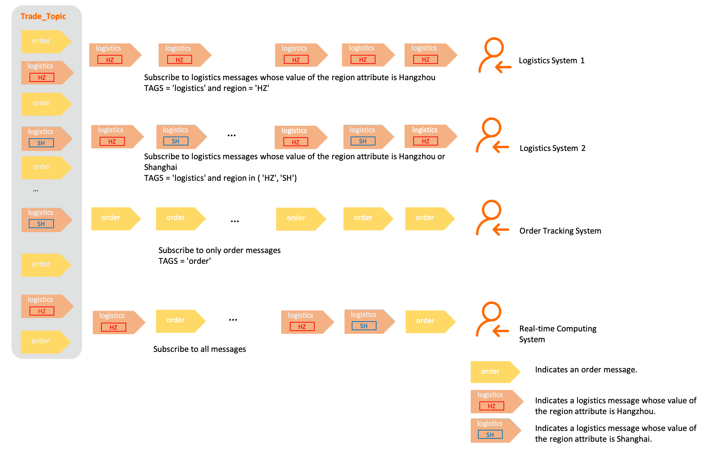

# 消息过滤

消费者订阅了某个主题后，Apache RocketMQ 会将该主题中的所有消息投递给消费者。若消费者只需要关注部分消息，可通过设置过滤条件在 Apache RocketMQ 服务端进行过滤，只获取到需要关注的消息子集，避免接收到大量无效的消息。本文介绍消息过滤的定义、原理、分类及不同过滤方式的使用方法、配置示例等。

## 应用场景

Apache RocketMQ 作为发布订阅模型的消息中间件广泛应用于上下游业务集成场景。在实际业务场景中，同一个主题下的消息往往会被多个不同的下游业务方处理，各下游的处理逻辑不同，只关注自身逻辑需要的消息子集。

使用 Apache RocketMQ 的消息过滤功能，可以帮助消费者更高效地过滤自己需要的消息集合，避免大量无效消息投递给消费者，降低下游系统处理压力。

Apache RocketMQ 主要解决的单个业务域即同一个主题内不同消息子集的过滤问题，一般是基于同一业务下更具体的分类进行过滤匹配。如果是需要对不同业务域的消息进行拆分，建议使用不同主题处理不同业务域的消息。

## 功能概述

**消息过滤定义**

过滤的含义指的是将符合条件的消息投递给消费者，而不是将匹配到的消息过滤掉。


Apache RocketMQ 的消息过滤功能通过生产者和消费者对消息的属性、标签进行定义，并在 Apache RocketMQ 服务端根据过滤条件进行筛选匹配，将符合条件的消息投递给消费者进行消费。

**消息过滤原理**


消息过滤主要通过以下几个关键流程实现：

* 生产者：生产者在初始化消息时预先为消息设置一些属性和标签，用于后续消费时指定过滤目标。

* 消费者：消费者在初始化及后续消费流程中通过调用订阅关系注册接口，向服务端上报需要订阅指定主题的哪些消息，即过滤条件。

* 服务端：消费者获取消息时会触发服务端的动态过滤计算，Apache RocketMQ 服务端根据消费者上报的过滤条件的表达式进行匹配，并将符合条件的消息投递给消费者。

**消息过滤分类**

Apache RocketMQ 支持Tag标签过滤和SQL属性过滤，这两种过滤方式对比如下：

| 对比项  |     Tag标签过滤      |              SQL属性过滤               |
|------|------------------|------------------------------------|
| 过滤目标 | 消息的Tag标签。        | 消息的属性，包括用户自定义属性以及系统属性（Tag是一种系统属性）。 |
| 过滤能力 | 精准匹配。            | SQL语法匹配。                           |
| 适用场景 | 简单过滤场景、计算逻辑简单轻量。 | 复杂过滤场景、计算逻辑较复杂。                    |


具体的使用方式及示例，请参见下文的Tag标签过滤和SQL属性过滤。

## 订阅关系一致性

过滤表达式属于订阅关系的一部分，Apache RocketMQ 的领域模型规定，同一消费者分组内的多个消费者的订阅关系包括过滤表达式，必须保持一致，否则可能会导致部分消息消费不到。更多信息，请参见[订阅关系（Subscription）](../03-领域模型/09subscription.md)。

## Tag标签过滤

Tag标签过滤方式是 Apache RocketMQ 提供的基础消息过滤能力，基于生产者为消息设置的Tag标签进行匹配。生产者在发送消息时，设置消息的Tag标签，消费者需指定已有的Tag标签来进行匹配订阅。

**场景示例**

以下图电商交易场景为例，从客户下单到收到商品这一过程会生产一系列消息：

* 订单消息

* 支付消息

* 物流消息

这些消息会发送到名称为Trade_Topic的Topic中，被各个不同的下游系统所订阅：

* 支付系统：只需订阅支付消息。

* 物流系统：只需订阅物流消息。

* 交易成功率分析系统：需订阅订单和支付消息。

* 实时计算系统：需要订阅所有和交易相关的消息。

过滤效果如下图所示：

**Tag标签设置**

* Tag由生产者发送消息时设置，每条消息允许设置一个Tag标签。

* Tag使用可见字符，建议长度不超过128字符。


**Tag标签过滤规则**

Tag标签过滤为精准字符串匹配，过滤规则设置格式如下：

* 单Tag匹配：过滤表达式为目标Tag。表示只有消息标签为指定目标Tag的消息符合匹配条件，会被发送给消费者。

* 多Tag匹配：多个Tag之间为或的关系，不同Tag间使用两个竖线（\|\|）隔开。例如，Tag1\|\|Tag2\|\|Tag3，表示标签为Tag1或Tag2或Tag3的消息都满足匹配条件，都会被发送给消费者进行消费。

* 全部匹配：使用星号（\*）作为全匹配表达式。表示主题下的所有消息都将被发送给消费者进行消费。


**使用示例**

* 发送消息，设置Tag标签。

  ```java
  Message message = messageBuilder.setTopic("topic")
  //设置消息索引键，可根据关键字精确查找某条消息。
  .setKeys("messageKey")
  //设置消息Tag，用于消费端根据指定Tag过滤消息。
  //该示例表示消息的Tag设置为"TagA"。
  .setTag("TagA")
  //消息体。
  .setBody("messageBody".getBytes())
  .build();
  ```

  

* 订阅消息，匹配单个Tag标签。

  ```java
  String topic = "Your Topic";
  //只订阅消息标签为"TagA"的消息。
  FilterExpression filterExpression = new FilterExpression("TagA", FilterExpressionType.TAG);
  pushConsumer.subscribe(topic, filterExpression);
  ```

  

* 订阅消息，匹配多个Tag标签。

  ```java
  String topic = "Your Topic";
  //只订阅消息标签为"TagA"、"TagB"或"TagC"的消息。
  FilterExpression filterExpression = new FilterExpression("TagA||TagB||TagC", FilterExpressionType.TAG);
  pushConsumer.subscribe(topic, filterExpression);
  ```

  

* 订阅消息，匹配Topic中的所有消息，不进行过滤。

  ```java
  String topic = "Your Topic";
  //使用Tag标签过滤消息，订阅所有消息。
  FilterExpression filterExpression = new FilterExpression("*", FilterExpressionType.TAG);
  pushConsumer.subscribe(topic, filterExpression);
  ```

  


## SQL属性过滤

SQL属性过滤是 Apache RocketMQ 提供的高级消息过滤方式，通过生产者为消息设置的属性（Key）及属性值（Value）进行匹配。生产者在发送消息时可设置多个属性，消费者订阅时可设置SQL语法的过滤表达式过滤多个属性。

:::info
Tag是一种系统属性，所以SQL过滤方式也兼容Tag标签过滤。在SQL语法中，Tag的属性名称为TAGS。
:::

**场景示例**

以下图电商交易场景为例，从客户下单到收到商品这一过程会生产一系列消息，按照类型将消息分为订单消息和物流消息，其中给物流消息定义地域属性，按照地域分为杭州和上海：

* 订单消息

* 物流消息
  * 物流消息且地域为杭州
  
  * 物流消息且地域为上海

这些消息会发送到名称为Trade_Topic的Topic中，被各个不同的系统所订阅：

* 物流系统1：只需订阅物流消息且消息地域为杭州。

* 物流系统2：只需订阅物流消息且消息地域为杭州或上海。

* 订单跟踪系统：只需订阅订单消息。

* 实时计算系统：需要订阅所有和交易相关的消息。


过滤效果如下图所示：

**消息属性设置**

生产者发送消息时可以自定义消息属性，每个属性都是一个自定义的键值对（Key-Value）。

每条消息支持设置多个属性。

**SQL属性过滤规则**

SQL属性过滤使用SQL92语法作为过滤规则表达式，语法规范如下：


|                                                                                         语法                                                                                          |                                  说明                                  |                                                                                                                    示例                                                                                                                    |
|-------------------------------------------------------------------------------------------------------------------------------------------------------------------------------------|----------------------------------------------------------------------|------------------------------------------------------------------------------------------------------------------------------------------------------------------------------------------------------------------------------------------|
| IS NULL                                                                                                                                                                             | 判断属性不存在。                                                             | `a IS NULL` ：属性a不存在。                                                                                                                                                                                                |
| IS NOT NULL                                                                                                                                                                         | 判断属性存在。                                                              | `a IS NOT NULL`：属性a存在。                                                                                                                                                                                              |
| * \>  * \>=  * \<  * \<=   | 用于比较数字，不能用于比较字符串，否则消费者客户端启动时会报错。 **说明** 可转化为数字的字符串也被认为是数字。           | * `a IS NOT NULL AND a > 100`：属性a存在且属性a的值大于100。  * `a IS NOT NULL AND a > 'abc'`：错误示例，abc为字符串，不能用于比较大小。   |
| BETWEEN xxx AND xxx                                                                                                                                                                 | 用于比较数字，不能用于比较字符串，否则消费者客户端启动时会报错。等价于\>= xxx AND \<= xxx。表示属性值在两个数字之间。 | `a IS NOT NULL AND (a BETWEEN 10 AND 100)`：属性a存在且属性a的值大于等于10且小于等于100。                                                                                                                                               |
| NOT BETWEEN xxx AND xxx                                                                                                                                                             | 用于比较数字，不能用于比较字符串，否则消费者客户端启动会报错。等价于\< xxx OR \> xxx，表示属性值在两个值的区间之外。   | `a IS NOT NULL AND (a NOT BETWEEN 10 AND 100)`：属性a存在且属性a的值小于10或大于100。                                                                                                                                               |
| IN (xxx, xxx)                                                                                                                                                                       | 表示属性的值在某个集合内。集合的元素只能是字符串。                                            | `a IS NOT NULL AND (a IN ('abc', 'def'))`：属性a存在且属性a的值为abc或def。                                                                                                                                                      |
| * =  *  \<\>                                                                                   | 等于和不等于。可用于比较数字和字符串。                                                  | `a IS NOT NULL AND (a = 'abc' OR a<>'def')`：属性a存在且属性a的值为abc或a的值不为def。                                                                                                                                               |
| * AND  * OR                                                                                    | 逻辑与、逻辑或。可用于组合任意简单的逻辑判断，需要将每个逻辑判断内容放入括号内。                             | `a IS NOT NULL AND (a > 100) OR (b IS NULL)`：属性a存在且属性a的值大于100或属性b不存在。                                                                                                                                               |


由于SQL属性过滤是生产者定义消息属性，消费者设置SQL过滤条件，因此过滤条件的计算结果具有不确定性，服务端的处理方式如下：

* 异常情况处理：如果过滤条件的表达式计算抛异常，消息默认被过滤，不会被投递给消费者。例如比较数字和非数字类型的值。

* 空值情况处理：如果过滤条件的表达式计算值为null或不是布尔类型（true和false），则消息默认被过滤，不会被投递给消费者。例如发送消息时未定义某个属性，在订阅时过滤条件中直接使用该属性，则过滤条件的表达式计算结果为null。

* 数值类型不符处理：如果消息自定义属性为浮点型，但过滤条件中使用整数进行判断，则消息默认被过滤，不会被投递给消费者。


**使用示例**

* 发送消息，同时设置消息Tag标签和自定义属性。

  ```java
  Message message = messageBuilder.setTopic("topic")
  //设置消息索引键，可根据关键字精确查找某条消息。
  .setKeys("messageKey")
  //设置消息Tag，用于消费端根据指定Tag过滤消息。
  //该示例表示消息的Tag设置为"messageTag"。
  .setTag("messageTag")
  //消息也可以设置自定义的分类属性，例如环境标签、地域、逻辑分支。
  //该示例表示为消息自定义一个属性，该属性为地域，属性值为杭州。
  .addProperty("Region", "Hangzhou")
  //消息体。
  .setBody("messageBody".getBytes())
  .build();
  ```

  

* 订阅消息，根据单个自定义属性匹配消息。

  ```java
  String topic = "topic";
  //只订阅地域属性为杭州的消息。
  FilterExpression filterExpression = new FilterExpression("Region IS NOT NULL AND Region='Hangzhou'", FilterExpressionType.SQL92);
  simpleConsumer.subscribe(topic, filterExpression);
  ```

  

* 订阅消息，同时根据多个自定义属性匹配消息。

  ```java
  String topic = "topic";
  //只订阅地域属性为杭州且价格属性大于30的消息。
  FilterExpression filterExpression = new FilterExpression("Region IS NOT NULL AND price IS NOT NULL AND Region = 'Hangzhou' AND price > 30", FilterExpressionType.SQL92);
  simpleConsumer.subscribe(topic, filterExpression);
  ```

  

* 订阅消息，匹配Topic中的所有消息，不进行过滤。

  ```java
  String topic = "topic";
  //订阅所有消息。
  FilterExpression filterExpression = new FilterExpression("True", FilterExpressionType.SQL92);
  simpleConsumer.subscribe(topic, filterExpression);
  ```

## 使用建议

**合理划分主题和Tag标签**

从消息的过滤机制和主题的原理机制可以看出，业务消息的拆分可以基于主题进行筛选，也可以基于主题内消息的Tag标签及属性进行筛选。关于拆分方式的选择，应遵循以下原则：

* 消息类型是否一致：不同类型的消息，如顺序消息和普通消息需要使用不同的主题进行拆分，无法通过Tag标签进行分类。

* 业务域是否相同：不同业务域和部门的消息应该拆分不同的主题。例如物流消息和支付消息应该使用两个不同的主题；同样是一个主题内的物流消息，普通物流消息和加急物流消息则可以通过不同的Tag进行区分。

* 消息量级和重要性是否一致：如果消息的量级规模存在巨大差异，或者说消息的链路重要程度存在差异，则应该使用不同的主题进行隔离拆分。


