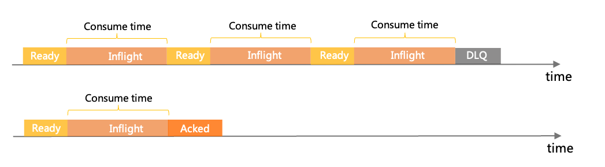
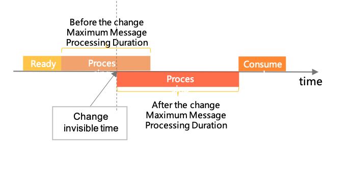

# 消费重试

消费者出现异常，消费某条消息失败时， Apache RocketMQ 会根据消费重试策略重新投递该消息进行故障恢复。本文介绍消费重试机制的原理、版本兼容性和使用建议。

## 应用场景

Apache RocketMQ 的消费重试主要解决的是业务处理逻辑失败导致的消费完整性问题，是一种为业务兜底的策略，不应该被用做业务流程控制。建议以下消费失败场景使用重试机制：

推荐使用消息重试场景如下：

* 业务处理失败，且失败原因跟当前的消息内容相关，比如该消息对应的事务状态还未获取到，预期一段时间后可执行成功。

* 消费失败的原因不会导致连续性，即当前消息消费失败是一个小概率事件，不是常态化的失败，后面的消息大概率会消费成功。此时可以对当前消息进行重试，避免进程阻塞。

典型错误使用场景如下：

* 消费处理逻辑中使用消费失败来做条件判断的结果分流，是不合理的，因为处理逻辑已经预见了一定会大量出现该判断分支。

* 消费处理中使用消费失败来做处理速率限流，是不合理的。限流的目的是将超出流量的消息暂时堆积在队列中达到削峰的作用，而不是让消息进入重试链路。


## 应用目的 


消息中间件做异步解耦时的一个典型问题是如果下游服务处理消息事件失败，如何保证整个调用链路的完整性。Apache RocketMQ 作为金融级的可靠业务消息中间件，在消息投递处理机制的设计上天然支持可靠传输策略，通过完整的确认和重试机制保证每条消息都按照业务的预期被处理。

了解 Apache RocketMQ 的消息确认机制以及消费重试策略可以帮助您分析如下问题：

* 如何保证业务完整处理消息：了解消费重试策略，可以在设计实现消费者逻辑时保证每条消息处理的完整性，避免部分消息出现异常时被忽略，导致业务状态不一致。

* 系统异常时处理中的消息状态如何恢复：帮助您了解当系统出现异常（宕机故障）等场景时，处理中的消息状态如何恢复，是否会出现状态不一致。


## 消费重试策略概述

消费重试指的是，消费者在消费某条消息失败后，Apache RocketMQ 服务端会根据重试策略重新消费该消息，超过一次定数后若还未消费成功，则该消息将不再继续重试，直接被发送到死信队列中。

**消息重试的触发条件**

* 消费失败，包括消费者返回消息失败状态标识或抛出非预期异常。

* 消息处理超时，包括在PushConsumer中排队超时。

**消息重试策略主要行为**

* 重试过程状态机：控制消息在重试流程中的状态和变化逻辑。

* 重试间隔：上一次消费失败或超时后，下次重新尝试消费的间隔时间。

* 最大重试次数：消息可被重试消费的最大次数。

**消息重试策略差异**

根据消费者类型不同，消息重试策略的具体内部机制和设置方法有所不同，具体差异如下：

|     消费者类型      |                                                                                                           重试过程状态机                                                                                                            |                                                               重试间隔                                                               |     最大重试次数      |
|----------------|------------------------------------------------------------------------------------------------------------------------------------------------------------------------------------------------------------------------------|----------------------------------------------------------------------------------------------------------------------------------|-----------------|
| PushConsumer   | * 已就绪  * 处理中  * 待重试  * 提交  * 死信   | 消费者分组创建时元数据控制。 * 无序消息：阶梯间隔  * 顺序消息：固定间隔时间   | 消费者分组创建时的元数据控制。 |
| SimpleConsumer | * 已就绪  * 处理中  * 提交  * 死信                                            | 通过API修改获取消息时的不可见时间。                                                                                                              | 消费者分组创建时的元数据控制。 |


具体的重试策略，请参见下文[PushConsumer消费重试策略](#section-qqo-bil-rc6)和[SimpleConsumer消费重试策略](#section-my2-2au-7gl)。

## PushConsumer消费重试策略 


**重试状态机**

PushConsumer消费消息时，消息的几个主要状态如下：

* Ready：已就绪状态。消息在Apache RocketMQ服务端已就绪，可以被消费者消费。

* Inflight：处理中状态。消息被消费者客户端获取，处于消费中还未返回消费结果的状态。

* WaitingRetry：待重试状态，PushConsumer独有的状态。当消费者消息处理失败或消费超时，会触发消费重试逻辑判断。如果当前重试次数未达到最大次数，则该消息变为待重试状态，经过重试间隔后，消息将重新变为已就绪状态可被重新消费。多次重试之间，可通过重试间隔进行延长，防止无效高频的失败。

* Commit：提交状态。消费成功的状态，消费者返回成功响应即可结束消息的状态机。

* DLQ：死信状态。消费逻辑的最终兜底机制，若消息一直处理失败并不断进行重试，直到超过最大重试次数还未成功，此时消息不会再重试，会被投递至死信队列。您可以通过消费死信队列的消息进行业务恢复。

  


消息重试过程中，每次重试消息状态都会经过已就绪\>处理中\>待重试的变化，两次消费间的间隔时间实际由消费耗时及重试间隔控制，消费耗时的最大上限受服务端系统参数控制，一般不应该超过上限时间。

**最大重试次数**

PushConsumer的最大重试次数由消费者分组创建时的元数据控制，具体参数，请参见[消费者分组](../03-领域模型/07consumergroup.md)。

例如，最大重试次数为3次，则该消息最多可被投递4次，1次为原始消息，3次为重试投递次数。

**重试间隔时间**

* 无序消息（非顺序消息）：重试间隔为阶梯时间，具体时间如下：

  | 第几次重试 | 与上次重试的间隔时间 | 第几次重试 | 与上次重试的间隔时间 |
  |-------|------------|-------|------------|
  | 1     | 10秒        | 9     | 7分钟        |
  | 2     | 30秒        | 10    | 8分钟        |
  | 3     | 1分钟        | 11    | 9分钟        |
  | 4     | 2分钟        | 12    | 10分钟       |
  | 5     | 3分钟        | 13    | 20分钟       |
  | 6     | 4分钟        | 14    | 30分钟       |
  | 7     | 5分钟        | 15    | 1小时        |
  | 8     | 6分钟        | 16    | 2小时        |

:::info
若重试次数超过16次，后面每次重试间隔都为2小时。
:::

* 顺序消息：重试间隔为固定时间，具体取值，请参见[参数限制](../01-基础介绍/03limits.md)。

**使用示例**

PushConsumer触发消息重试只需要返回消费失败的状态码即可，当出现非预期的异常时，也会被SDK捕获。

```java
SimpleConsumer simpleConsumer = null;
        //消费示例：使用PushConsumer消费普通消息，如果消费失败返回错误，即可触发重试。
        MessageListener messageListener = new MessageListener() {
            @Override
            public ConsumeResult consume(MessageView messageView) {
                System.out.println(messageView);
                //返回消费失败，会自动重试，直至到达最大重试次数。
                return ConsumeResult.FAILURE;
            }
        };
            
```

## SimpleConsumer消费重试策略 


**重试状态机**

SimpleConsumer消费消息时，消息的几个主要状态如下：

* Ready：已就绪状态。消息在Apache RocketMQ服务端已就绪，可以被消费者消费。

* Inflight：处理中状态。消息被消费者客户端获取，处于消费中还未返回消费结果的状态。

* Commit：提交状态。消费成功的状态，消费者返回成功响应即可结束消息的状态机。

* DLQ：死信状态。消费逻辑的最终兜底机制，若消息一直处理失败并不断进行重试，直到超过最大重试次数还未成功，此时消息不会再重试，会被投递至死信队列。您可以通过消费死信队列的消息进行业务恢复。

和PushConsumer消费重试策略不同的是，SimpleConsumer消费者的重试间隔是预分配的，每次获取消息消费者会在调用API时设置一个不可见时间参数 InvisibleDuration，即消息的最大处理时长。若消息消费失败触发重试，不需要设置下一次重试的时间间隔，直接复用不可见时间参数的取值。


由于不可见时间为预分配的，可能和实际业务中的消息处理时间差别较大，您可以通过API接口修改不可见时间。

例如，您预设消息处理耗时最多20 ms，但实际业务中20 ms内消息处理不完，您可以修改消息不可见时间，延长消息处理时间，避免消息触发重试机制。

修改消息不可见时间需要满足以下条件：

* 消息处理未超时

* 消息处理未提交消费状态

如下图所示，消息不可见时间修改后立即生效，即从调用API时刻开始，重新计算消息不可见时间。


**最大重试次数**

SimpleConsumer的最大重试次数由消费者分组创建时的元数据控制，具体参数，请参见[消费者分组](../03-领域模型/07consumergroup.md)。

**消息重试间隔**

消息重试间隔=不可见时间－消息实际处理时长

SimpleConsumer 的消费重试间隔通过消息的不可见时间控制。例如，消息不可见时间为30 ms，实际消息处理用了10 ms就返回失败响应，则距下次消息重试还需要20 ms，此时的消息重试间隔即为20 ms；若直到30 ms消息还未处理完成且未返回结果，则消息超时，立即重试，此时重试间隔即为0 ms。

**使用示例**

SimpleConsumer 触发消息重试只需要等待即可。

```java
 //消费示例：使用SimpleConsumer消费普通消息，如果希望重试，只需要静默等待超时即可，服务端会自动重试。
        List<MessageView> messageViewList = null;
        try {
            messageViewList = simpleConsumer.receive(10, Duration.ofSeconds(30));
            messageViewList.forEach(messageView -> {
                System.out.println(messageView);
                //如果处理失败，希望服务端重试，只需要忽略即可，等待消息再次可见后即可重试获取。
            });
        } catch (ClientException e) {
            //如果遇到系统流控等原因造成拉取失败，需要重新发起获取消息请求。
            e.printStackTrace();
        }
```
## 使用建议

**合理重试，避免因限流等诉求触发消费重试**

上文[应用场景](#section-d2i-0sk-rtf)中提到，消息重试适用业务处理失败且当前消费为小概率事件的场景，不适合在连续性失败的场景下使用，例如消费限流场景。

* 错误示例：如果当前消费速度过高触发限流，则返回消费失败，等待下次重新消费。

* 正确示例：如果当前消费速度过高触发限流，则延迟获取消息，稍后再消费。


**合理控制重试次数，避免无限重试**

虽然Apache RocketMQ支持自定义消费重试次数，但是建议通过减少重试次数+延长重试间隔来降低系统压力，避免出现无限重试或大量重试的情况。
