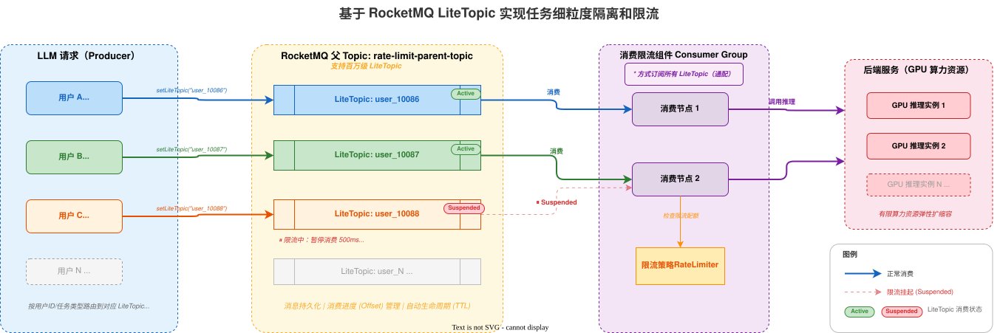

# 基于 RocketMQ LiteTopic 实现任务细粒度隔离和限流

本文档详细介绍了如何利用 Apache RocketMQ 的 **LiteTopic** 特性，构建一套通用的、支持海量任务细粒度隔离和限流动态管理系统。

## 背景与挑战
在 AI 推理和业务处理场景中（如图片生成、视频渲染、大规模计算等），后端服务通常依赖 GPU 等高成本计算资源。作为平台服务提供方，在算力资源有限的前提下，需要优先保障重要用户或关键任务类型的服务质量。

在确保高优算力资源合理分配的同时，平台还需应对以下典型挑战：

+ **资源隔离**：重要客户或关键任务的请求需独占处理资源池，避免与其他流量混用。
+ **流量互不干扰**：同等优先级的客户之间应相互隔离，防止单一客户的突发流量挤占资源，导致其他客户的请求长期排队。
+ **动态订阅管理**：用户 ID 列表或任务类型列表实时变化，下游消费者需动态调整订阅关系，新增或移除订阅目标。
+ **细粒度限流**：当某一类型或某一用户的请求量超过最大处理能力时，需针对该维度单独暂停消费，进行退避处理，而不影响其他维度。
+ **集群级流量治理**：当集群整体处理能力达到上限时，需识别并暂停 Top 流量队列的消费，待集群完成扩缩容后再逐步恢复。
+ **削峰填谷**：平滑波动较大的请求流量，保障后端服务的稳定性和可用性。

### 传统方案的局限性
#### 方案一：基于 RocketMQ 普通 Topic 隔离
为每个用户 ID 或任务类型创建独立的 Topic 和 ConsumerGroup，并为每个 ConsumerGroup 启动对应的消费者实例。该方案存在以下问题：

+ Topic 和 ConsumerGroup 属于重资源，创建后生产者和消费者需完成连接初始化等资源准备，影响消息发送和消费的平滑性。
+ 下游消费者需主动感知上游生产者侧用户或任务类型列表的变化，动态增删订阅关系，无法实现真正的生产者与消费者解耦。

#### 方案二：基于 Kafka 隔离
Kafka 与 RocketMQ 普通 Topic 方案面临相同的重资源问题。若尝试通过 Kafka Topic 的 Partition 来映射不同用户或任务类型，单个 Topic 分区数过多会导致 Broker 资源消耗和性能开销急剧上升，引入稳定性风险。

## 解决方案
### 核心架构：基于LiteTopic的细粒度隔离和限流



本文采用 Apache RocketMQ 的 **LiteTopic（轻量级主题）** 特性，构建了一套全新的细粒度隔离与动态限流架构：

+ **消息发送端**：根据业务维度（如用户 ID、模型 ID、任务类型）将消息路由至对应的 LiteTopic。
+ **消息消费端**：消费者统一订阅父 Topic（即所有 LiteTopic），当 LiteTopic 动态新增或移除时，消费者无需调整订阅关系，只要消费集群容量充足即可持续工作。

### LiteTopic 的核心优势
+ **轻量级与海量支持**：单个实例内可支持百万级 LiteTopic，可为每个用户或任务类型创建专属的轻量级队列，满足大规模细粒度隔离需求。
+ **资源解耦与高效复用**：LiteTopic 无需预先创建，消息写入时按需自动生成，不影响发送耗时；空闲后按内置 TTL 策略自动清理，实现全自动化生命周期管理。
+ **精准流控能力**：消费端支持返回 Suspend 状态，可精确挂起指定 LiteTopic 暂停消费，实现毫秒级精细化限流，且仅影响目标 LiteTopic，不干扰其他队列的正常消费。
+ **物理隔离与逻辑统一**：每个用户或业务维度拥有独立的 LiteTopic，实现数据层面的隔离；同时所有消费实例归属同一 ConsumerGroup，共享线程池等资源，兼顾隔离性与资源利用率。

## 操作步骤
### 步骤一：创建父 Topic
在 Apache RocketMQ 控制台或通过 API 创建一个父 Topic，用于承载所有 LiteTopic。所有限流对象共享同一个父 Topic，无需为每个用户单独创建。

示例配置：

+ Topic 名称：`rate-limit-parent-topic`
+ 消息类型：普通消息

> **说明**：父 Topic 是 LiteTopic 的载体，一个父 Topic 下可承载百万级 LiteTopic。

### 步骤二：创建 Consumer Group
创建一个统一的 Consumer Group，所有消费机器共用该 Group。

示例配置：

+ Group 名称：`GID_rate_limit_consumer`
+ 消费模式：**集群消费**

### 步骤三：发送消息到 LiteTopic
在消息发送端，根据用户标识将消息写入对应的 LiteTopic。LiteTopic 无需预先创建，首次发送时自动生成。

```java
// 父 Topic 名称
String topic = "rate-limit-parent-topic";

// 获取 Producer 实例
final Producer producer = ProducerSingleton.getInstance(topic);

// 构造消息体
byte[] body = "your message content".getBytes(StandardCharsets.UTF_8);

// 以用户标识作为 LiteTopic 名称，实现按用户隔离
String userId = "user_10086";

final Message message = provider.newMessageBuilder()
    // 设置父 Topic
    .setTopic(topic)
    // 设置 LiteTopic，按用户维度隔离
    .setLiteTopic(userId)
    .setBody(body)
    .build();

try {
    final SendReceipt sendReceipt = producer.send(message);
    log.info("Message sent successfully, messageId={}", sendReceipt.getMessageId());
} catch (LiteTopicQuotaExceededException e) {
    // LiteTopic 数量超过实例配额限制
    log.error("LiteTopic quota exceeded, please upgrade instance", e);
} catch (Throwable t) {
    log.error("Failed to send message", t);
}
```

**关键说明**：

+ `setLiteTopic()` 的参数为 LiteTopic 名称，建议使用用户 ID、任务类型 ID 等业务标识，便于后续限流策略匹配。
+ 当 LiteTopic 首次被写入消息时，系统自动创建该队列，无需额外操作。
+ 若 LiteTopic 数量超过实例配额，将抛出 `LiteTopicQuotaExceededException`，此时需升级实例规格。

### 步骤四：消费消息并实施限流
消费端使用 `LitePushConsumer` 订阅父 Topic 下的全部 LiteTopic，并在消息处理逻辑中根据业务限流策略进行流控。

```java
String consumerGroup = "GID_rate_limit_consumer";
String topic = "rate-limit-parent-topic";

// 构建 LitePushConsumer 实例
LitePushConsumer litePushConsumer = provider.newLitePushConsumerBuilder()
    .setClientConfiguration(clientConfiguration)
    // 设置消费者组
    .setConsumerGroup(consumerGroup)
    // 绑定父 Topic
    .bindTopic(topic)
    // 设置消息监听器
    .setMessageListener(messageView -> {
        // 获取消息所属的 LiteTopic（即用户标识）
        String liteTopic = messageView.getLiteTopic();

        // 执行业务逻辑（如调用下游服务）
        boolean success = processMessage(messageView);

        if (success) {
            // 业务处理成功
            // 检查该用户是否需要限流
            if (rateLimiter.shouldLimit(liteTopic)) {
                // 返回 Suspend，暂停该 LiteTopic 的拉取
                // 参数为暂停时长，期间不会拉取该 LiteTopic 的新消息
                return ConsumeResult.Suspend(Duration.ofMillis(500));
            }
            return ConsumeResult.SUCCESS;
        } else {
            // 业务处理失败，消息将被重试
            return ConsumeResult.FAILURE;
        }
    })
    .build();
```

**关键说明**：

+ `ConsumeResult.Suspend(Duration)` 是 LiteTopic 提供的核心限流机制：返回该结果后，Broker 将在指定时间内暂停对该 LiteTopic 的消息拉取，但不影响其他 LiteTopic 的正常消费。
+ 限流策略（`rateLimiter.shouldLimit()`）由业务侧自行实现，可基于滑动窗口、令牌桶等算法，按用户维度控制消费速率。

### 步骤五：实现限流策略（参考示例）
以下是一个基于固定窗口的限流器简化示例，按 LiteTopic（即用户）维度控制消费速率：

```java
import java.util.Map;
import java.util.concurrent.ConcurrentHashMap;
import java.util.concurrent.atomic.AtomicInteger;

public class LiteTopicRateLimiter {

    // 每个 LiteTopic 的速率限制配置：key = liteTopic, value = 每秒允许的最大消费数
    private final Map<String, Integer> rateLimitConfig;

    // 固定窗口计数器
    private final Map<String, AtomicInteger> windowCounters = new ConcurrentHashMap<>();

    /**
     * 判断指定 LiteTopic 是否需要限流
     * @param liteTopic LiteTopic 名称（用户标识）
     * @return true 表示需要限流
     */
    public boolean shouldLimit(String liteTopic) {
        Integer maxQps = rateLimitConfig.get(liteTopic);
        if (maxQps == null) {
            // 未配置限流策略，不限流
            return false;
        }

        AtomicInteger counter = windowCounters.computeIfAbsent(
            liteTopic, k -> new AtomicInteger(0));

        return counter.incrementAndGet() > maxQps;
    }

    /**
     * 定时重置窗口计数器（每秒执行一次）
     */
    @Scheduled(fixedRate = 1000)
    public void resetWindow() {
        windowCounters.values().forEach(c -> c.set(0));
    }
}
```

## 最佳实践
### LiteTopic 命名规范
建议使用业务语义明确的命名规则，便于运维排查和限流策略匹配。

+ 按用户限流：`{userId}`，例如 `user_10086`
+ 按用户 + 业务类型限流：`{userId}_{bizType}`，例如 `user_10086_premium`
+ 按任务类型限流：`{taskType}_{taskId}`，例如 `sms_task_001`

### Suspend 时长选择
Suspend 时长直接影响限流效果和消息处理延迟，建议根据业务场景合理设置：

+ **轻度限流**（降速但不阻塞）：50~200 毫秒
+ **中度限流**（明显降低消费速率）：200~1000 毫秒
+ **重度限流**（接近暂停消费）：1000~5000 毫秒

### 与后端弹性扩容配合
在后端服务弹性扩容场景中，建议结合 Suspend 机制实现平滑的流量增长控制：

1. 流量突发初期，对超出阈值的用户返回较大的 Suspend 值（如 2000 毫秒），大幅降低消费速率。
2. 随着后端扩容逐步完成，动态减小 Suspend 值（如从 2000 毫秒逐步降至 100 毫秒），使流量平滑增长。
3. 扩容完成后，取消限流策略，恢复正常消费速率。

该策略可使消费流量增长曲线尽可能匹配后端算力扩容曲线，最小化因扩容时间窗口导致的服务不可用问题。

## 相关文档
+ [Apache RocketMQ 官方文档](https://rocketmq.apache.org/docs/)
+ [RocketMQ 5.x 客户端 SDK 接入指南](https://rocketmq.apache.org/docs/sdk/java/)
