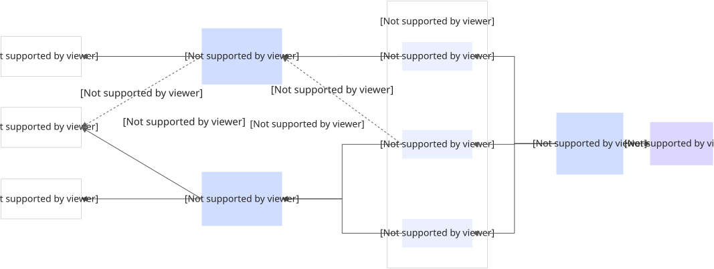

# 基于 RocketMQ LiteTopic 解决分布式会话状态管理难题

本文档详细介绍了如何利用Apache RocketMQ的LiteTopic特性，构建一个分布式的、高可用的会话状态管理系统。

## 背景与挑战

在构建现代AI应用时，开发者经常面临一个棘手的难题：如何在长连接（如WebSocket或SSE）不稳定的网络环境中保证会话的连续性。传统的会话管理方式在节点故障或网络重连时容易导致上下文丢失和算力浪费，主要体现在以下几个方面：

* **长耗时与多轮次**：大语言模型（LLM）的推理过程通常需要数秒甚至更久，且用户与AI的交互往往是多轮对话，上下文依赖极强。

* **高算力成本**：每一次AI任务的执行都消耗昂贵的GPU资源。如果因为网络波动导致连接中断，进而导致任务作废，将造成巨大的资源浪费。

* **长连接的不稳定性**：AI应用通常使用SSE或WebSocket等长连接技术来实时推送流式结果。然而，在实际生产环境中，网关或服务节点重启、连接超时、移动端网络切换等异常情况不可避免。

**传统架构的痛点：** 在传统的单体或简单的分布式架构中，会话状态往往绑定在特定的应用服务节点上。一旦用户的长连接断开并重连到另一个节点，新的节点无法获取之前的会话状态，导致对话中断，用户体验极差。

## 解决方案

为了解决上述痛点，我们提出了一种基于Apache RocketMQ的分布式会话状态管理方案。该方案利用RocketMQ的轻量级主题（LiteTopic）作为会话消息的传输通道，将应用服务节点设计为无状态，从而实现会话的高可用和连续性。

### 系统架构

* **应用服务端（无状态）**：应用服务可以横向扩展为多个节点（节点1、节点2...）。它们不存储会话状态，只负责处理连接和消息转发。

* **RocketMQ LiteTopic**：利用LiteTopic作为会话的"管道"。每个会话（Session）对应一个唯一的LiteTopic，命名规则建议为`chat/{sessionID}`。

* **大模型任务调度组件**：负责与LLM交互，并将生成的流式数据发送到对应的LiteTopic中。

### 通信流程

1. **会话建立与初始连接**

   1. **用户接入**：Web端2发起请求，与应用服务端节点1建立长连接（如WebSocket）。

   2. **会话创建**：系统生成唯一的SessionID（例如Session2）。

   3. **订阅通道**：应用服务端节点1根据SessionID，订阅RocketMQ中对应的LiteTopic（即`LiteTopic2`，命名为`chat/SessionID2`）。

   4. **任务调度**：大模型任务调度组件接收到请求后，开始调用LLM，并将LLM返回的流式数据（Token）逐条发送到`LiteTopic2`。

   5. **消息推送**：节点1接收到消息后，通过长连接实时推送给Web端2。

2. **异常处理与断线重连**

   当网络波动或节点故障发生时，系统展现出强大的恢复能力：

   1. **连接中断**：假设Web端2与节点1之间的连接意外断开。此时，节点1会检测到连接关闭，并取消对`LiteTopic2`的订阅。

   2. **自动重连**：Web端2的客户端逻辑触发自动重连机制。由于负载均衡的存在，这次重连请求被分发到了应用服务端节点2。

   3. **状态接管**：

      1. 节点2接收到重连请求，解析出SessionID（Session2）。

      2. 节点2立即向RocketMQ发起订阅请求，订阅`LiteTopic2`。

   4. **消息续传**：

      1. RocketMQ具有消息持久化和消费进度管理能力。当节点2订阅`LiteTopic2`时，它会根据LiteTopic的消费进度（Offset），从断点处继续拉取后续未消费的消息。

      2. 大模型任务调度组件继续向`LiteTopic2`发送数据，这些数据现在被节点2接收并推送给Web端2。

### 方案优势

* **会话连续性**：无论重连到哪个节点，都能通过订阅同一个LiteTopic无缝获取后续消息，用户无感知。

* **资源保护**：由于会话状态保存在RocketMQ中，连接中断不会导致后台的大模型任务停止，避免了昂贵的算力浪费。

* **弹性伸缩**：应用服务端完全无状态，可以根据流量负载随意扩缩容，无需担心会话粘滞（Session Sticky）问题。

### 总结

通过引入Apache RocketMQ的LiteTopic，我们成功解决了AI应用中棘手的分布式会话管理问题。这种架构不仅实现了应用节点的无状态化，提升了系统的弹性伸缩能力，更重要的是保证了在复杂网络环境下用户体验的连续性和AI算力资源的高效利用。对于构建企业级、高可用的AI Agent应用，这是一套经过验证的最佳实践方案。
