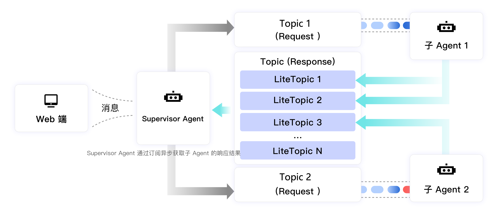

# 基于 RocketMQ LiteTopic 实现多智能体的异步通信

本文档详细介绍了如何利用Apache RocketMQ实现高并发、可扩展的Multi-Agent系统。

## 背景与挑战

随着AI应用场景的日益复杂，单Agent架构已难以满足需求，Multi-Agent系统成为发展趋势。然而，AI任务的长耗时特性使得传统的同步调用方式面临线程阻塞和扩展性问题。本文通过实践教程的形式，展示了如何使用RocketMQ的消息队列和LiteTopic特性，构建一个异步通信的Multi-Agent系统，有效解决长耗时调用阻塞痛点，并提升系统的整体性能和可扩展性。

## 解决方案

### 系统架构

* **Web端**：用户交互界面，向系统发起请求并接收最终结果。

* **Supervisor Agent（监管Agent）**：系统的核心调度者。它负责接收Web端的请求，将复杂任务拆解为多个子任务，并分发给相应的子Agent。同时，它也负责收集子Agent的处理结果，进行汇总后返回给Web端。

* **子Agent（Worker Agent）**：负责执行具体的、专业化的子任务。每个子Agent专注于自己擅长的领域。

### 通信流程

整个通信流程分为请求和响应两个阶段，均通过RocketMQ进行异步解耦：

1. **请求阶段**：

   1. Supervisor Agent接收到Web端的请求后，将任务进行拆解。

   2. 为每个子任务创建一个请求消息，并发送到对应的**请求主题（Request Topic）**。例如，可以为"子Agent 1"创建"Topic 1 (Request)"，为"子Agent 2"创建"Topic 2 (Request)"。

   3. 子Agent各自订阅自己负责的请求主题，一旦有新消息到达，便立即开始处理。

2. **响应阶段**：

   1. Supervisor Agent在处理请求的同时，会创建一个**响应主题（Response Topic）**，并订阅该主题。这个响应主题是一个特殊的**轻量类型的Topic**。

   2. 子 Agent 处理将每个任务的响应结果发送到Topic (Response) 的**LiteTopic**中。这个LiteTopic可以用唯一的TaskID或 SessionID 来命名，确保结果能够被正确路由。

   3. Supervisor Agent通过订阅响应主题，可以实时接收到各个子Agent返回的结果。

   4. 最后，Supervisor Agent将所有子任务的结果进行汇总，并通过 HTTP 协议实时推送给Web端，实现流式响应。

## 关键技术：RocketMQ LiteTopic

在本方案中，RocketMQ的**LiteTopic**特性扮演了至关重要的角色。

传统的消息队列主题（Topic）在创建和管理上可能涉及较多的资源和配置，LiteTopic是一种轻量级的主题，它具有以下优势，非常适用于Multi-Agent的响应场景：

* **动态创建与销毁**：可以为每一个任务动态创建一个专属的LiteTopic（例如，以任务ID命名），TTL到期后可以自动销毁，无需预先配置大量的主题，极大地提升了系统的灵活性和资源利用率。

* **隔离性**：每个会话或任务都有专属的LiteTopic，相比于普通Topic，LiteTopic的创建和维护成本更低，适合大规模、高并发的短生命周期消息场景。

* **精准订阅**：在同一个ConsumerGroup下，每个Consumer可以订阅不同的LiteTopic集合。

* **顺序消息**：同一个LiteTopic下的消息是顺序的，可以保障流式响应结果的正确性。

## 总结

本教程展示了如何利用Apache RocketMQ，特别是其LiteTopic特性，构建一个高效、解耦的Multi-Agent异步通信系统。该方案成功地将长耗时的AI任务调用从同步阻塞模式转变为异步非阻塞模式，不仅解决了线程阻塞的痛点，还通过消息队列的缓冲和削峰填谷能力，极大地提升了系统的稳定性和可扩展性。这种架构模式为构建复杂、专业的AI应用提供了坚实的基础。
