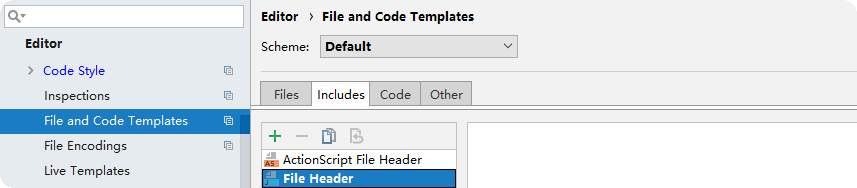

# 代码指南

## 前言

本文向您介绍编码规范和编码指南。

研究表明软件开发的 80% 时间用于软件维护，包括源码解读，源码重构，源码维护等。

约定并强制推行编码规范和编码指南，有助于提高代码的可读性，维护开发团队代码所有权，

帮助工程师快速深入理解新增代码，并简化维护成本。

## IDEA 编程模板

下面分别引导您在 IDEA 中导入 ```rmq_codeStyle.xml``` 编码规范文件， ```Apache.xml``` 贡献许可文件

### 导入 Code Style

1.  文件位置：源码 ```rocketmq/style``` 目录下 ```rmq_codeStyle.xml```

2.  Apple OS 导入：```IntelliJ IDEA > Settings > Code Style ``` 。进入 ```Code Style``` 标签页，依次选择 ```Manage > Import``` ，导入文件并命名 ```Scheme```

3. Windows OS 导入：```IntelliJ IDEA > Settings > Code Style > Import Scheme```


4. 导入的 ```rmq_codeStyle.xml``` 指定了代码的缩进格式，命名规范，标准 Java 约定等

5. IDEA 设置完成后会自动 reformat 代码，以便通过 Travis CI 的代码风格校验

## 导入 Apache V2

1. 文件位置：源码 ```rocketmq/style/copyright``` 目录 ```Apache.xml```


2. 许可说明： [Apache License, Version 2.0](https://www.apache.org/licenses/LICENSE-2.0) 

## 选择 Apache 版权


可参考  [五种开源协议(GPL,LGPL,BSD,MIT,Apache) - OSCHINA - 中文开源技术交流社区](https://www.oschina.net/question/54100_9455) 了解详情

## 移除 Javadoc 标签

1. 依次选择：```Settings > Editor > File and Code Templates > Includes```

2. 进入 ```File Header``` 页签下，删除其中的 Javadoc 标签



