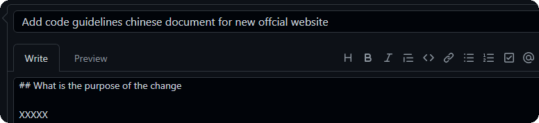

#  Github提交PR

本文将引导您通过 Git 贡献 RocketMQ

## Github 远程仓库

本小节作为前置知识，简要说明使用 Git 贡献 RocketMQ 原因，有相关基础的同学可以自行跳过

首先您需要自行了解 Git 和 GitHub 相关概念

思考：从开发者角度，如何与他人协作完成项目？

如果您想到通过打包压缩然后复制粘贴的方式，那么请再试想一下扩大参与者的范围至 10k+ 级别

这就是远程仓库的意义：开发者可以很方便地从 GitHub 上获取仓库代码，并提交开发分支到远程仓库与他人交流和共享


那么，有了这个公共仓库，然后呢？

如何下载远程仓库的代码？

如何提交开发分支到远程仓库？

## Git 贡献指南

① fork [apache/rocketmq](https://github.com/apache/rocketmq) 仓库至个人 GitHub 远程仓库

```shell
$ https://github.com/cuser/rocketmq.git # cuser's rocketmq repo[repository] url
```

说明：```cuser``` GitHub用户名，```Fork``` 后可通过个人主页 Repositories ，找到复刻仓库并查看地址

② 自行安装 Git 并克隆到本地仓库

```shell
$ git clone https://github.com/cuser/rocketmq.git # git clone [repo url]
```

说明：克隆到的本地仓库会以 GitHub 仓库作为远程仓库，并以```origin```命名远程仓库

③ 获取开发分支最新代码

```shell
$ git rebase origin/develop # git rebase [branch]
```

说明： [rebase` <branch>`](https://git-scm.com/docs/git-rebase) 基本说法是换基，可通过链接示例了解该步的必要性

④ 在本地仓库执行更改

```shell
$ git checkout -b RocketMQ-Vxx.0 # git checkout [-b] [new-branch]
$ git add /rocketmq/pom.xml # git add [dir/file]
$ git commit -a -m "pom"	# git commit [-all] [-msg] [message]
```

说明： 参考[Git](https://git-scm.com/docs/git-add)了解详情，使用相对路径请切换至 ```.git``` 同级目录

⑤ 推送更改到远程仓库

```shell
$ git push --set-upstream apache RocketMQ-Vxx.0	# push branch to https://github.com/cuser/rocketmq-site.git
```

## Github 提交 PR

如下：以提交 PR 至 ```new-official-website``` 分支为例说明 PR 流程

参照```Git 贡献指南```在本地仓库修改完毕，并将该分支推送到 Github 远程仓库

```shell
$ git checkout new-official-website	# git checkout -b new-official-website
$ git push origin new-official-website	# push to https://github.com/cuser/rocketmq-site.git
```

① Github 远程仓库切换至开发分支 new-official-website

② 创建合并请求，点击 Contribute 下的 Open pull request

③ compare across forks 选择请求分支和开发分支


base repository / base : 请求仓库及请求分支

head repository / compare : 开发仓库及开发分支

注意请务必正确选择请求分支与开发分支，并请在得到分支所有者许可后再请求合入

④ 填写首字母大写的 PR 摘要，并在 Write 标签下简要描述 PR 内容



​	提交 PR 前，请先做如下确认：

1. 已创建与 PR 对应的 [GitHub Issue]( [apache/rocketmq: Mirror of Apache RocketMQ (github.com)](https://github.com/apache/rocketmq/issues) )
2. 修改内容符合 [Coding Guidelines](/docs/contributionGuide/02code-guidelines) 编程规范
3. PR 摘要以 [ISSUE #XXX] 开始并简要描述变更需求
4. 概述 PR 变更需求，变更日志，验证信息，可参考 [PR Demo](https://github.com/apache/rocketmq/pull/152) 
5. 提交内容具备完整的测试用例，并确保基本检查，单元测试，集成测试通过

⑤ 点击 "Create pull request" ，请求合并该分支

⑥ 至此，PR 已经在 apache/rocketmq-site 远程仓库上可见，所有协作者都可以 Review 该PR 并提供建议

您可以根据评论在本地完成修改并进行多次提交。请求合并和提交修改的相关信息会同步展示在 PR 页面、issue 列表、RocketMQ 的邮件列表中，以便提醒 committer 及时审核 PR

## 合并 PR

开源项目开发分支合并由 committer 完成。

① 合并 contributor PR

```shell
$ git checkout develop	# switch to local develop branch
$ git pull apache develop	# fast-forward to current remote HEAD
$ git pull --squash https://github.com/cuser/rocketmq.git RocketMQ-Vxx.0  # merge to branch
```

拉取的请求合并分支可能包含多次提交，建议使用 ```--squash``` 指令压缩为一次 commit

合并前务必要解决合并冲突，并确保当前分支同步于远程分支

请阅读 [Git pull]( [Git - git-pull Documentation (git-scm.com)](https://git-scm.com/docs/git-pull) ) 了解 fast-forward 等相关详情

② 合并 committer PR

若 committer 合并自己的 PR , 使用 [Git merge]( [Git - git-merge Documentation (git-scm.com)](https://git-scm.com/docs/git-merge) ) 即可

```shell
$ git checkout develop      # switch to local develop branch
$ git pull apache develop   # fast-forward to current remote HEAD
$ git merge --squash RocketMQ-Vxx.0	# merge to branch
```

③ 进行常规的补丁检查，使用内置的测试用例构建项目，并请务必修改 changelog 

④ 若上述工作均已完成，可以执行下面的指令提交合并，回馈开发者分支状态，并关闭 PR

```shell
$ git commit --author="contributor_name <contributor_email>" -a -m "RocketMQ-Vxx.0 description closes apache/rocketmq#ZZ"
```

关闭 PR 的详情，请参考 [Close PR](https://docs.github.com/cn/issues/tracking-your-work-with-issues/closing-an-issue) 

⑤ 将合并后的分支推送到 apache/rocketmq 远程仓库

```shell
$ git push apache develop
```

⑥ PR 被提交后，会保留到 GitHub 远程仓库，也可以同步更新个人 GitHub 仓库

```shell
$ git push origin develop
```

关于合并修改的建议：squash 会丢弃开发分支的 commit 信息

## 拒绝 PR

拒绝 PR ：意味着并不执行 pull 或 merge，而仅仅提交拒绝 PR 信息

```SHELL
$ git commit --allow-empty -m "RocketMQ-Vxx.0 closes apache/rocketmq#ZZ *Won't fix*"
$ git push apache develop
```

关闭 Github 上编号 #ZZ 的 PR


