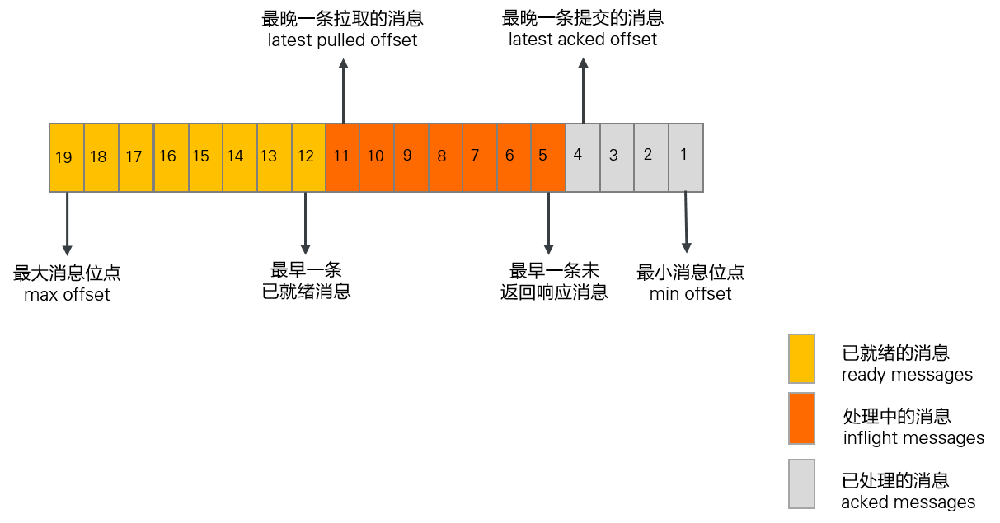
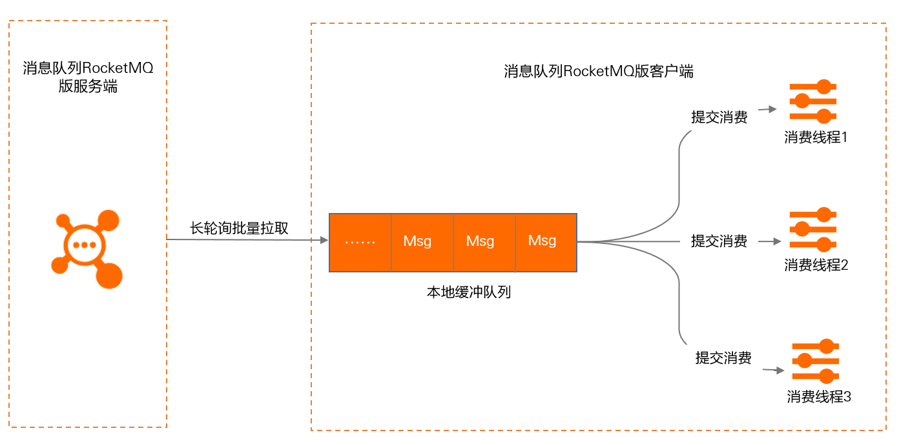

# Metrics
RocketMQ 以 Prometheus 格式公开以下指标。您可以使用这些指标监视您的集群。

- 服务端Metrics指标
- 生产者Metrics指标
- 消费者Metrics指标

>版本支持：以下指标 Metrics 是从 5.1.0 版本开始支持。

## Metrics指标详情

### Metric types
消息队列RocketMQ版定义的Metrics完全兼容开源Prometheus的标准，提供的Metrics的类型为Counter、Gauge和Histogram。更多信息，请参见 [METRIC TYPES](https://prometheus.io/docs/concepts/metric_types/)。

### 服务端Metrics指标
消息队列RocketMQ版服务端相关Metrics指标中Label的说明如下：
- cluster: RocketMQ 集群名称。
- node_type: 服务节点类型。枚举值包含proxy、broker、nameserver。
- node_id: 服务节点ID。
- topic: 消息队列RocketMQ的主题。
- message_type: 消息类型。有以下类型: Normal:普通消息; FIFO:顺序消息; Transaction:事务消息; Delay:定时/延时消息.
- consumer_group: 消费者 ID。

| Metrics类型 | Metrics name | 单位 | 指标说明 | Label |
| --- | ----- | --- | ---------- | --- |
| counter | rocketmq_messages_in_total | count | 消息生产数量。| cluster,node_type,node_id,topic,message_type |
| counter | rocketmq_messages_out_total | count | 消息消费数量。| cluster,node_type,node_id,topic, consumer_group|
| counter | rocketmq_throughput_in_total | byte | 消息生产流入服务端的吞吐量。| cluster,node_type,node_id,topic,message_type |
| counter | rocketmq_throughput_out_total | byte | 消息消费从服务端流出的吞吐量。| cluster,node_type,node_id,topic, consumer_group|
| histogram | rocketmq_message_size | byte | 消息大小的分布情况，发送成功时统计。分布区间如下： le_1_kb: ≤ 1 KB  le_4_kb: ≤ 4 KB le_512_kb: ≤ 512 KB le_1_mb: ≤ 1 MB le_2_mb: ≤ 2 MB le_4_mb: ≤ 4 MB le_overflow: > 4 MB | cluster,node_type,node_id,topic,message_type |
| gauge | rocketmq_consumer_ready_messages | count | 已就绪消息量。| cluster,node_type,node_id,topic, consumer_group |
| gauge | rocketmq_consumer_inflight_messages | count | 处理中消息量。| cluster,node_type,node_id,topic, consumer_group |
| gauge | rocketmq_consumer_queueing_latency | millisecond | 已就绪消息排队延迟时间。 | cluster,node_type,node_id,topic, consumer_group |
| gauge | rocketmq_consumer_lag_latency | millisecond | 消费处理延迟时间。 | cluster,node_type,node_id,topic, consumer_group |
| counter | rocketmq_send_to_dlq_messages_total | count | 转为死信状态的消息量。（变成死信状态指的是消息达到最大重投次数后不再投递） | cluster,node_type,node_id,topic, consumer_group |
| histogram | rocketmq_rpc_latency | millisecond | rpc 调用耗时： le_1_ms le_3_ms le_5_ms le_10_ms le_100_ms le_1_s le_3_s le_overflow | cluster,node_typ,node_id,protocol_type,request_code,response_code |
| gauge | rocketmq_storage_message_reserve_time | millisecond | 储存层消息保存时间（broker 硬盘上最早一条消息储存时间和当前时间作差） | cluster,node_type,node_id |
| gauge | rocketmq_storage_dispatch_behind_bytes | byte | dispatch 落后大小 | cluster,node_type,node_id |
| gauge | rocketmq_storage_flush_behind_bytes | byte | 刷盘落后大小。 | cluster,node_type,node_id |
| gauge | rocketmq_thread_pool_wartermark | count | 线程池排队数 | cluster,node_type,node_id,name |

### 生产者Metrics指标
消息队列RocketMQ版生产者相关Metrics指标中Label的说明如下：
- cluster: RocketMQ 集群名称。
- node_type: 服务节点类型。枚举值包含proxy、broker、nameserver。
- node_id: 服务节点ID。
- topic: 消息队列RocketMQ的主题。
- message_type: 消息类型。有以下类型: Normal:普通消息; FIFO:顺序消息; Transaction:事务消息; Delay:定时/延时消息.
- client_id: 客户端ID。
- invocation_status: 消息发送接口调用结果，枚举值包含 success 和 failure。

| Metrics类型 | Metrics name | 单位 | 指标说明 | Label |
| --- | ----- | --- | ---------- | --- |
| Histogram | rocketmq_send_cost_time | millisecond | 调用消息发送接口成功的耗时分布情况。分布区间如下：:  le_1_ms  le_5_ms le_10_ms le_20_ms  le_50_ms  le_200_ms le_500_ms  le_overflow | topic,client_id,invocation_status |

### 消费者Metrics指标
消息队列RocketMQ版消费者相关Metrics指标中Label的说明如下：
- topic: 消息队列RocketMQ的主题。
- consumer_group: 消费者分组ID。
- client_id: 客户端ID。
- invocation_status: 消费结果, 枚举值包含 success 和 failure。

| Metrics类型 | Metrics name | 单位 | 指标说明 | Label |
| --- | ----- | --- | ---------- | --- |
| Histogram | rocketmq_process_time | millisecond | PushConsumer的消息处理耗时分布情况.分布区间如下:  le_1_ms  le_5_ms   le_10_ms le_100_ms  le_10000_ms le_60000_ms  le_overflow | topic,consumer_group,client_id,invocation_status |
| gauge | rocketmq_consumer_cached_messages | message | PushConsumer本地缓冲队列中的消息条数。| topic,consumer_group,client_id |
| gauge | rocketmq_consumer_cached_bytes | byte | PushConsumer本地缓冲队列中消息的总大小。| topic,consumer_group,client_id |
| Histogram | rocketmq_await_time | millisecond | 消息在PushConsumer本地缓冲队列中的排队时间的分布情况: le_1_ms  le_5_ms le_20_ms le_100_ms  le_1000_ms  le_5000_ms  le_10000_ms le_overflow | topic,consumer_group,client_id |

## 指标业务场景
消息队列RocketMQ版主要基于以下业务场景定义Metrics指标.

### 消息堆积场景
 上图表示指定主题的某一队列中各消息的状态，消息队列RocketMQ版将处于不同处理阶段的消息数量和耗时进行统计，这些指标可直接反映队列中消息的处理速率和堆积情况，通过观察这些指标可初步判断业务的消费是否异常。具体的指标含义和计算公式如下：

| 名称 | 描述 | 计算公式 |
| --- | --- | --- |
| 处理中的消息（inflight messages） | 在消费者客户端正在处理，但客户端还未返回消费结果的消息。 | 最晚一条拉取消息的位点－最晚一条提交消息的位点 |
| 已就绪消息（ready messages） | 消息在消息队列RocketMQ版服务端已就绪，对消费者可见可被消费的消息。 | 最大消费位点－最晚一条拉取消息的位点 |
| 已就绪消息的就绪时间（ready time） | 普通消息、顺序消息：消息存储到服务端的时间。   定时/延时消息：消息定时或延时结束的时间。    事务消息：事务提交的时间。 | -- |
| 已就绪消息的排队时间（ready message queue time）| 该时间反应消费者拉取消息的及时性。 | 当前时间－最早一条就绪消息的就绪时间 |
| 消费处理滞后时间（consumer lag time） | 该时间反应消费者完成消息处理的及时性。 | 当前时间－最早一条未提交消息的就绪时间|

### PushConsumer 消费场景
在PushConsumer类型中，消息的实时处理能力是基于SDK内部的典型Reactor线程模型实现的。如下图所示，SDK内置了一个长轮询线程，先将消息异步拉取到SDK内置的缓存队列中，再分别提交到消费线程中，触发监听器执行本地消费逻辑。  在PushConsumer消费场景下，本地缓冲队列相关指标如下：

- 本地缓冲队列中的消息量：本地缓冲队列中的消息总条数。
- 本地缓冲队列中的消息大小：本地缓冲队列中所有消息大小的总和。
- 消息等待处理时间：消息暂存在本地缓冲队列中的时间。

